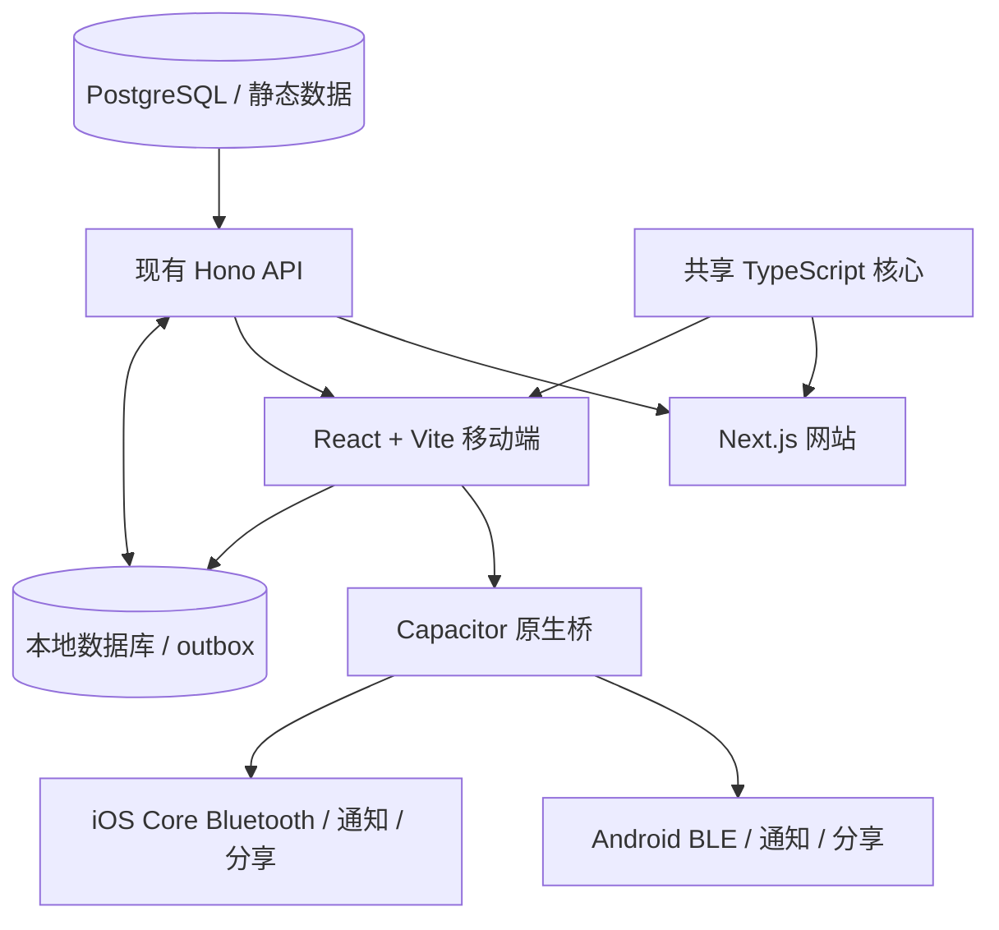

# CubeRoot Android / iOS App 完整路线图

> 状态：执行中
>
> 更新日期：2026-08-12
>
> 目标：以最低长期维护成本，把 CubeRoot 的高频能力发布到 Google Play 和 Apple App Store，并逐步覆盖全球可用地区。
>
> 原则：网站继续是完整产品和内容源；App 只承担高频、离线和原生能力，不复制整站。

## 0. 执行进度（唯一事实源）

本节是移动端工作的进度账本。只有完成实现并取得对应验证证据后才打勾；只完成代码但缺少真机、账号或商店证据的项目保持未勾选，并注明依赖条件。

### 阶段 0：身份、账号和合规底座

- [x] 发布者采用组织路线；现有公司和营业执照可用于后续组织验证。
- [x] 产品名暂定 `CubeRoot`，正式标识暂定 `me.cuberoot.app`，首发语言为英文和简体中文。
- [ ] 确定公开开发者名称、支持邮箱、地址和联系电话。（需要所有者确认公开资料）
- [ ] 注册并完成 Google Play Console 组织账号验证。（需要所有者操作账号、付款和身份验证）
- [ ] 核对 D-U-N-S 并完成 Apple Developer Program 组织账号验证。（需要所有者操作账号和组织验证）
- [ ] 建立 15 到 20 人 Android 测试名单和联系渠道。（需要真实测试者）
- [ ] 建立发布账号 2FA、恢复方式、密码管理和签名密钥备份规则。（需要账号所有者参与）
- [ ] 完成真实数据清单、第三方 SDK 清单、隐私政策、账号删除页和支持页。

### 阶段 1：技术验证

- [x] Windows 上的 Android SDK、JDK、adb 和 Gradle 构建链可用。
- [x] 已建立 `core/packages/mobile` React + Vite + Capacitor workspace，Web 资源从本地 `dist` 打包。
- [x] Debug 使用独立 application ID `me.cuberoot.app.debug`，Release 保留 `me.cuberoot.app`。
- [x] 已构建并在 MuMu 模拟器安装 Debug APK，验证启动、横竖屏和 Android 返回键。
- [x] 已验证 HTTPS 网络访问；当前远程网站入口仅为过渡验证，不计作正式 App 核心体验。
- [ ] 用本地计时等核心能力替换自动打开远程网站的过渡界面。
- [ ] 在实体 Android 设备验证启动、触摸、键盘、安全区、旋转、后台恢复和 adb 日志。（当前没有 Android 真机）
- [ ] 用实体 Android 设备和智能魔方完成 BLE 扫描、连接、读写和通知 spike。（模拟器无法代替）
- [ ] 输出 BLE 插件能力报告和“现成插件或自有桥”架构决定。（依赖 BLE spike）

当前证据：

- 基础工程提交：`b2328f45f3`。
- Debug/Release application ID 隔离提交：`73ca6bb116`。
- MuMu 过渡网络壳验证提交：`0c6cb4d55c`。
- Debug APK：`core/packages/mobile/android/app/build/outputs/apk/debug/app-debug.apk`。

### 阶段 2：共享核心边界

- [x] 完成计时器、打乱、统计、存储、训练、BLE、API 和设置的依赖盘点。
- [x] 提取计时记录模型、校验、统计和序列化，网站与 App 使用同一实现。
  - [x] 计时记录模型、观察罚时规则和统计函数已迁入 `@cuberoot/shared/timer`，网站原路径保留兼容导出。
  - [x] 输入校验和版本化序列化已共享；App 的 IndexedDB 仓储只接受通过统一 schema 校验的数据。
- [ ] 提取无框架依赖的打乱生成核心，网站与 App 使用同一实现。
- [ ] 定义 BLE transport，并逐步让现有 Web 驱动与未来原生驱动共用协议层。
- [x] 共享层回归测试和移动端 adapter contract tests 全部通过。
  - [x] 共享包构建、网站 typecheck、93 个计时/统计测试和 4 个复盘真值 fixture 已通过。
  - [x] 移动端仓储 adapter 的 6 个 contract tests 已通过，覆盖首次初始化、并发写、修改/删除、导入导出、损坏数据和设置校验。

当前证据：

- 共享计时模型、统计和观察规则提交：`6fec2c94c3`。
- 共享计时状态机提交：`fba563fc35`。
- 版本化 schema、IndexedDB 仓储和 adapter contract tests 提交：`ac5a88bf39`。

### 阶段 3：PWA 补强和网站兜底

- [ ] 完成 manifest、图标、启动 URL 和 standalone 行为复核。
- [ ] 实现明确边界的离线缓存、升级、回滚和清理策略。
- [ ] 验证断网刷新、账号隔离及 COOP/COEP 特殊路由。

### 阶段 4：Android 基础 MVP

- [ ] 本地导航完成：计时、训练、资料/设置。
- [ ] 触摸计时、检查时间、`+2`、DNF、删除和备注闭环。
- [ ] WCA 打乱、项目、session、PB、平均和基础趋势闭环。
- [ ] 本地数据库、schema 迁移、进程重启恢复和数据导出闭环。
- [ ] 公式集拉取、离线缓存和训练闭环。
- [ ] 英文/简体中文、深浅主题、保亮、震动、分享和深链闭环。
- [ ] API client 的超时、认证、错误和版本头统一。
- [ ] TalkBack、动态字号、对比度和触摸目标基础检查通过。
- [ ] 生成并验证 Android 内部测试 AAB。

### 阶段 5：原生智能魔方

- [ ] Android BLE 权限、可选硬件声明和权限拒绝恢复完成。
- [ ] Native BLE transport 的扫描、连接、读写、通知、MTU 和断线事件完成。
- [ ] 至少一个真实型号端到端跑通，并建立设备/固件/系统矩阵。
- [ ] 掉通知、后台、蓝牙关闭、距离中断和最终一步恢复验证通过。
- [ ] 脱敏诊断导出和无需实体魔方的审核 demo 模式完成。

### 阶段 6：账号、同步和合规闭环

- [ ] 确定首发登录方式并完成 Apple 4.8 专项判断。
- [ ] 原生安全存储、token 刷新、匿名数据合并和多设备同步完成。
- [ ] outbox、幂等重试、冲突策略和旧版 API 兼容测试通过。
- [ ] App 内账号注销和网页删除入口端到端验证通过。
- [ ] 隐私政策、服务条款、支持页、数据保留说明和 SDK 清单发布。
- [ ] Google Data safety 与 Apple App Privacy 草稿和代码事实核对完成。

### 阶段 7：Google Play 封闭测试

- [ ] Play internal track 的签名 AAB、升级和回滚验证通过。
- [ ] Closed test 至少 12 人连续满足当时适用的测试要求。
- [ ] 离线、同步、BLE、后台、升级、注销和设备矩阵反馈闭环。
- [ ] Production access 获批，商店说明、截图、图标、内容评级和隐私资料完成。

### 阶段 8：Android 正式发布

- [ ] 已测试的同一构建分阶段放量，监控崩溃、ANR、登录、同步、BLE 和 API。
- [ ] 100% 放量且无已知 P0/P1，记录版本号、commit、AAB digest 和商店状态。
- [ ] 上传密钥、恢复资料、上一版兼容和暂停发布能力验证完成。

### 阶段 9：iOS 移植与 TestFlight

- [ ] 准备受支持的 Mac/Xcode、Apple 组织账号和 iPhone 真机。（目前已有 iPhone，缺 Mac 和已验证开发者账号）
- [ ] iOS 工程、签名、Core Bluetooth、Keychain、Universal Links 和分享完成。
- [ ] iOS 权限、后台、系统中断、安全区、动态字体和 VoiceOver 验证通过。
- [ ] Sign in with Apple/登录合规、TestFlight 和 App Store 审核资料完成。
- [ ] App Store 审核通过，且业务逻辑未复制为 iOS 专属实现。

### 阶段 10：全球发布和长期维护

- [ ] 按地区和质量指标逐步扩大可用范围。
- [ ] 发布 runbook、版本支持矩阵、政策/证书日历和质量看板完成。
- [ ] 建立每月发版、季度兼容测试、半年隐私复核和年度账号维护节奏。

## 1. 先说结论

CubeRoot 最适合的路线不是把整个网站原样塞进 WebView，也不是重新用 Flutter、Swift 和 Kotlin 各写一遍，而是：

1. 网站继续负责完整内容、SEO、后台、长文和重型工具。
2. 新建一个独立的 React + Vite + Capacitor 移动端壳，先做 Android，再做 iOS。
3. 从现有网站提取计时、训练、公式、同步和智能魔方协议中的纯逻辑，网站和 App 共用。
4. Android 和 iOS 只分别实现少量必须原生化的能力：BLE、权限、通知、震动、保亮、深链、分享、文件和相机。
5. 公式、统计、比赛、公告等内容继续由现有 API/静态数据提供；这些内容更新后无需重新上架。
6. 只有打包进 App 的界面或代码发生变化时，才构建新版本并经过商店审核。

推荐首发范围：

- 本地优先的计时器、打乱和训练记录。
- 原生智能魔方连接。
- 公式训练和离线缓存。
- 登录、同步、语言、主题、深链和分享。
- 少量真正适合手机的 WCA/比赛提醒。

首发暂不搬进 App：

- 管理后台和内容编辑器。
- 大型统计图表和低频 WCA 数据页。
- 数学、百科、规则等长文全集。
- 重型视频复盘、超大 WASM 求解器和小众工具全集。
- 任何只为“App 看起来功能多”而复制的网页。

## 2. 项目目标和非目标

### 2.1 目标

- Windows 环境下先完成 Android 开发、测试和上架。
- 将 Android 的架构做成可以平滑迁移到 iOS，而不是 Android 一次性工程。
- 网站内容更新时，App 尽量自动读取新内容，不要求同步改两份。
- App 离线时仍能计时、查看已缓存公式、训练和保存记录。
- iOS 用户能直接连接智能魔方，不再依赖 Bluefy。
- 支持英文和简体中文，并允许在商店支持的国家和地区尽量广泛分发。
- 发布、签名、测试、上传和商店资料逐步自动化。
- 保持 API 向后兼容，允许旧版 App 在用户未及时升级时继续工作。

### 2.2 非目标

- 不追求第一版覆盖网站 100% 功能。
- 不在第一版同时维护 React Web、Kotlin Android、Swift iOS 三套业务 UI。
- 不把远程网站 URL 当成 App 的主要运行代码。
- 不在没有实体设备验证的情况下承诺支持某个智能魔方型号。
- 不把“中国大陆 Android 全渠道分发”误认为勾选一个国家即可完成。
- 不以绕过审核为目的伪报应用类别、数据用途或账号类型。

## 3. CubeRoot 现状审计

### 3.1 已经可以复用的基础

当前仓库已经具备：

- Next.js 网站和统一的中英文语言边界。
- `manifest.json`、192/512 图标、maskable 图标和 standalone 显示模式。
- 移动端安全区和窄屏适配基础。
- 现有 Hono API、账号系统、WCA OAuth、内容数据库和静态统计数据。
- 计时器、打乱、训练、模拟器以及大量智能魔方协议实现。
- GAN、Giiker、GoCube、MoYu、QiYi 等设备协议和合成测试基础。
- 完整的账号注销后端清理清单。
- GitHub Actions、Next 部署和后端迁移管道，可继续扩展移动端构建。

### 3.2 不能直接当作移动 App 的部分

- 当前 `sw.js` 是清除旧 Service Worker 的 kill-switch，不是真正离线缓存实现。
- 当前智能魔方入口直接依赖 `navigator.bluetooth`；iOS Safari 不提供 Web Bluetooth，因此网站需要 Bluefy。
- 当前 Next.js App Router 包含服务端路由、动态页面、代理和构建期行为，不能直接假设能导出成一个完整静态目录给 Capacitor。
- 部分求解器依赖 COOP/COEP、Worker、WASM 和大资源，不能直接全量搬入移动壳。
- 页面组件中可能含 Next 路由、服务端组件、浏览器 API 和网站布局依赖，需要先区分“纯逻辑”和“网站专属 UI”。

### 3.3 对架构的直接影响

因此移动端应新建独立入口，而不是修改现有 Next 配置强行静态导出整站。复用应发生在以下层级：

- 数据结构、校验、算法和状态机。
- 计时器核心、训练调度和智能魔方协议解析。
- API client、认证模型和同步规则。
- 不依赖 Next 的轻量 React 组件。
- 设计 token、图标和双语文案资源。

以下内容保留平台实现：

- Next 路由、SEO 和服务端渲染属于网站。
- Capacitor 导航、原生桥、权限和离线数据库属于 App。
- BLE 扫描连接由 Android/iOS 原生层负责；协议解析尽量共用 TypeScript。

## 4. 同行通常怎么做

成熟产品通常不是把网站完整复刻到手机，而是共享账号、数据和后端，再为移动场景挑选高频工作流、离线能力和系统能力。

| 产品 | 移动端重点 | 对 CubeRoot 的启发 | 官方资料 |
|---|---|---|---|
| GitHub | 通知、收件箱、评审和移动工作流与网站同步 | App 聚焦随手处理，不必搬完整开发后台 | [GitHub 通知设置](https://docs.github.com/en/subscriptions-and-notifications/get-started/configuring-notifications) |
| Notion | 共享同一工作区和数据，但移动端承认部分桌面能力有限；按页面提供离线使用 | 共享数据源，明确哪些页面适合离线，不假装移动端与桌面完全相同 | [Notion 移动端](https://www.notion.com/help/notion-for-mobile)、[离线页面](https://www.notion.com/help/use-pages-offline) |
| Linear | 手机端聚焦查看、更新、创建和通知，复杂管理仍更适合桌面 | CubeRoot App 应优先计时、训练、连接和提醒 | [Linear 移动端](https://linear.app/docs/get-the-app) |
| Steam | 手机端强化登录确认、商店、聊天和通知等原生场景 | App 可以承担系统通知和认证辅助，而非复刻全部 PC 能力 | [Steam Mobile](https://store.steampowered.com/mobile/?l=english&show=steamapp) |
| ChatGPT | 在手机上强化语音、相机、屏幕分享等设备能力 | 原生 App 的价值应来自 BLE、相机、震动和系统集成 | [ChatGPT 语音模式](https://help.openai.com/en/articles/20001274) |
| Spotify | 账号和内容云端共享，移动端对下载内容提供离线播放 | 训练素材和公式可选择性下载，不能把所有数据无条件缓存 | [Spotify 离线使用](https://support.spotify.com/us/article/listen-offline/) |

可复用的行业规律：

1. 一个账号和一个后端，而不是网站账号与 App 账号分裂。
2. 数据同步优先于页面长得完全一致。
3. 手机端围绕高频动作和硬件能力设计。
4. 离线是明确选择和状态，不是“缓存应该碰巧能用”。
5. 管理、长文和重型操作可以留在网站。
6. App 能链接回网站，但核心体验不能只是一个网站浏览器。

## 5. 技术路线选择

### 5.1 方案比较

| 方案 | 现有代码复用 | 原生 BLE | iOS | 长期维护 | 审核风险 | 结论 |
|---|---:|---:|---:|---:|---:|---|
| 纯 PWA | 高 | Android 部分可用，iOS 不可用 | 无商店级原生能力 | 最低 | 无 App Store 产品 | 保留为网站增强，不是最终 App |
| 纯 WebView / 远程 URL 套壳 | 很高 | 需要额外桥接 | 可做 | 表面低、实际易碎 | Apple 4.2 风险高 | 不作为正式路线 |
| Android TWA | 很高 | 仍受 Web 能力限制 | 不支持 | 低 | Android 可行但价值有限 | 不选 |
| React Native / Expo | 中低 | 可用 | 可用 | 中 | 低 | 会重写较多 DOM/CSS 组件 |
| Flutter | 低 | 可用 | 可用 | 高 | 低 | 对本项目复用率太低 |
| 原生 Kotlin + Swift | 最低 | 最强 | 最强 | 最高 | 低 | 团队规模不合适 |
| React + Vite + Capacitor | 高 | 通过插件或自有桥可用 | 可用 | 较低 | 低到中 | 推荐 |

### 5.2 为什么推荐 Capacitor

- 继续使用 TypeScript、React、CSS 和现有前端知识。
- Android 可完全在 Windows 上开发和构建。
- 业务逻辑可与网站共享，不必为 iOS 重写一次。
- 能调用 Android BLE 和 Apple Core Bluetooth。
- 能接入通知、震动、保亮、分享、深链和本地存储。
- 最后仍生成真实 Android/iOS 工程，能进入官方商店。

需要接受的边界：

- 不能把现有 Next 运行目录直接等同于 Capacitor 的静态资源目录。
- 必须为移动端建立一个可输出 `index.html` 和静态资源的 Vite 应用。
- Capacitor 每次发布仍需把 Web bundle 复制到原生工程并重新构建。
- 原生插件、权限或打包代码变化仍需经过商店审核。

## 6. 推荐架构



### 6.1 建议的代码边界

初始建议，不要求第一天就拆出所有包：

```text
core/
  packages/
    client/             # 现有 Next 网站
    mobile/             # 新 React + Vite + Capacitor App
    shared/             # 已有共享类型和轻量纯函数
    timer-core/         # 未来按需要提取：计时状态机、统计、序列化
    smartcube-core/     # 未来按需要提取：协议解析、解密、状态恢复
    sync-core/          # 未来按需要提取：变更队列、冲突规则
```

不要一开始空建很多抽象包。正确顺序是：

1. 移动端要复用一个已有模块。
2. 先确认它不依赖 Next、DOM 或 Web Bluetooth。
3. 用 `git mv`/最小改动提取到共享位置。
4. 网站改为 import 共享模块并跑原有回归测试。
5. 移动端再 import 同一个模块。

### 6.2 BLE 分层

智能魔方代码应拆为两层：

```ts
interface BleTransport {
  scan(options: ScanOptions): Promise<DeviceRef[]>;
  connect(device: DeviceRef): Promise<void>;
  discover(serviceIds: string[]): Promise<void>;
  read(serviceId: string, characteristicId: string): Promise<DataView>;
  write(serviceId: string, characteristicId: string, value: Uint8Array): Promise<void>;
  subscribe(
    serviceId: string,
    characteristicId: string,
    onValue: (value: DataView) => void,
  ): Promise<() => Promise<void>>;
  disconnect(): Promise<void>;
}
```

- Web adapter：包装现有 `navigator.bluetooth`，网站继续使用。
- Native adapter：包装 Android BLE / iOS Core Bluetooth 插件。
- Protocol layer：GAN、MoYu、QiYi 等解密、校验、时钟拟合、掉步恢复和状态机。
- UI layer：设备选择、连接状态、错误提示和权限引导。

先把传输接口定义清楚，再迁移协议。不要在每个设备 driver 里分别调用 Capacitor 插件，否则未来每个 bug 都要改很多份。

### 6.3 数据和同步规则

不同数据不能用同一种冲突策略：

| 数据 | 离线行为 | 建议同步规则 |
|---|---|---|
| 计时记录 | 必须离线创建 | 客户端 UUID；append-only；删除用 tombstone |
| 训练进度 | 必须离线更新 | 按练习项合并次数、最后时间和复习状态 |
| 设置 | 本地立即生效 | 字段级 last-write-wins，记录更新时间 |
| 公式内容 | 可离线读取 | 服务器权威；按版本或 ETag 增量刷新 |
| WCA/比赛/统计 | 缓存只读 | 服务器权威；TTL + 手动刷新 |
| 用户资料 | 短期离线展示 | 服务器权威；写入失败进 outbox |
| 会员/权限 | 可缓存但不能永久信任 | 服务端校验；给短期 grace period |

同步必须具备：

- 本地 schema version 和迁移。
- outbox 重试，不因断网丢用户操作。
- 幂等写入键，防止重试产生重复记录。
- 明确的 `createdAt`、`updatedAt`、`deletedAt` 或 revision。
- 登录前匿名数据与登录后账号数据的合并规则。
- 退出登录时是否保留本地记录的明确选择。
- 同一账号多设备修改时的冲突日志。
- API 版本兼容和最低支持 App 版本。

### 6.4 远程内容与远程代码的边界

可以远程更新而不重新审核：

- 公式、教程正文、比赛、统计、公告。
- 功能开关、实验参数、最低版本提示。
- 服务器返回的 JSON 配置和已审核 UI 能渲染的数据。

不应把以下内容当成免审核热更新：

- 下载一段新 JavaScript，改变 App 的主要功能。
- 从服务器下发未经审核的新可执行模块。
- 用远程网页悄悄替换已审核的核心 App。

Apple 的自包含和远程代码规则会使这种“全量热更新”方案有风险。CubeRoot 应做服务器驱动内容，不做服务器驱动可执行代码。

## 7. 网站更新后，App 到底要不要改

这是长期省心的关键。按变更类型判断：

| 变更 | 网站是否立即更新 | App 是否立即更新 | 是否需要商店审核 |
|---|---:|---:|---:|
| 数据库里的公式、名称、教程内容 | 是 | 下次同步后是 | 否 |
| 静态统计 JSON / 比赛数据 | 是 | 刷新缓存后是 | 否 |
| 后端修复且响应兼容旧版 | 是 | 自动受益 | 否 |
| 网站 SEO、长文布局、管理后台 | 是 | 不相关 | 否 |
| 共享核心逻辑修复 | 是 | 需要构建新版 | 是 |
| App 内打包的 UI / 文案 | 网站视改动而定 | 需要构建新版 | 是 |
| BLE 插件、权限、原生代码 | 否或部分 | 需要构建新版 | 是 |
| 图标、启动图、商店截图 | 否 | 需要更新资料或版本 | 通常需要审核 |
| 隐私用途、数据收集或付费模型 | 可能 | 必须同步更新声明和实现 | 通常需要审核 |

结论：大部分内容更新不用改 App；真正打包在 App 里的代码变化才发版。这与主流产品的维护方式一致。

## 8. 成本预算

以下金额以 2026-08-12 的官方美元标价为准，税费和汇率按注册地区另算。

### 8.1 必须支付的商店账号费用

| 项目 | 费用 | 周期 | 备注 |
|---|---:|---|---|
| Google Play Console | 25 美元 | 一次性 | 开发者账号注册费 |
| Apple Developer Program | 99 美元 | 每年 | 维持上架、签名和发布能力 |
| 两个平台首年合计 | 124 美元 | 首年 | 不含税 |
| 第二年起最低固定费用 | 99 美元/年 | 每年 | Google 不重复收注册费 |

官方依据：[Google Play 开发者账号](https://support.google.com/googleplay/android-developer/answer/6112435?hl=en)、[Apple 会员对比](https://developer.apple.com/support/compare-memberships/)。

### 8.2 很容易漏掉的实际成本

| 类别 | 最省方案 | 稳妥方案 | 是否首发必需 |
|---|---|---|---:|
| Android 设备 | 用现有真机和测试者设备 | 至少覆盖低端、主流、高刷/大屏设备 | 是，至少 1 台真机 |
| iPhone/iPad | 后期借用真机 | 至少 1 台当前受支持 iPhone | iOS 阶段必需 |
| Mac | 后期短租云 Mac / CI runner | 自有受支持 Mac | iOS 构建签名必需 |
| 智能魔方 | 只支持已有实测设备 | 建立型号和固件矩阵 | BLE 功能必需 |
| 截图和视频 | 自己制作 | 设计和本地化外包 | 是 |
| 隐私政策和条款 | 自己整理事实 | 法律专业复核 | 是，专业复核视风险 |
| 崩溃监控 | 自建日志或免费额度 | 托管服务 | 强烈建议 |
| CI 构建 | GitHub 免费额度内 | 付费 macOS/Android 分钟 | 可后置 |
| 客服 | 现有支持邮箱 | 工单系统和 SLA | 是，至少邮箱 |
| 翻译 | 英文 + 简中自有 | 增加重点市场语言 | 全球可用不等于全语言 |

### 8.3 开发时间成本

对熟悉现有仓库的单人开发，粗略规划值：

- PWA 基础补强：1 到 2 周。
- Android 技术验证壳：1 到 2 周。
- 可用 Android v1：4 到 8 周；BLE 型号多、离线同步复杂时按 6 到 10 周准备。
- Android + iOS 双平台首版：6 到 12 周，不含账号审核和外部等待。
- 后续常规维护：每月集中一个小版本，紧急崩溃或协议修复例外。

这些是范围估算，不是承诺工期。最大的变量不是页面数量，而是 BLE 真机矩阵、离线同步、登录合规和首次审核整改。

### 8.4 外包参考区间

仅作为预算量级，不是报价：

- 简单混合壳和基础账号：约人民币 3 万到 10 万。
- 含可靠 BLE、离线同步和双平台的正式产品：约人民币 10 万到 30 万以上。
- 设备适配、长期维护、设计、合规和服务器工作通常另计。

CubeRoot 已有大量核心代码和后端，自研的现金成本较低，但测试时间不能省。

### 8.5 如果以后收费

数字功能、订阅、会员和内容购买会触发 Apple/Google 的支付政策、佣金、税务和地区差异。2026 年各地区支付规则仍在变化，不能先假定网站付款链接一定允许直接放进 App。

第一版最省心做法：

- 不在 App 内新增购买入口。
- 允许已有账号登录并使用其合法权益前，逐条核对对应商店政策。
- 真正准备做移动端付费时单独设计商品、恢复购买、退款、家庭共享、服务端收据校验和地区规则。

## 9. 审核与总时间

### 9.1 Google Play

如果是 2023-11-13 之后创建的个人开发者账号，申请正式发布前通常需要：

1. 建立 closed test。
2. 至少 12 名测试者持续选择加入 14 天。
3. 在 Play Console 申请 production access。
4. Google 表示该申请通常会在 7 天内完成，但可能更久。
5. 单次应用变更审核应预留最多 7 天，特殊情况可能更长。

官方说明：[个人账号测试要求](https://support.google.com/googleplay/android-developer/answer/14151465?hl=en)、[审核处理时间](https://support.google.com/googleplay/android-developer/answer/9859751?hl=en)。

因此，代码可测试以后到第一次公开发布，现实日历至少应留 3 到 4 周；考虑测试者掉队、问卷、补材料和驳回，计划按 4 到 6 周更稳妥。

注意：14 天从测试版本可用且测试者真正 opt-in 后开始，不是从注册账号那天开始。

### 9.2 Apple App Store

Apple 公布的数据是 90% 的提交在 24 小时内完成审核，但这不是保证。第一次发布仍建议留出 1 到 2 周缓冲，用于：

- 账号或组织验证。
- 隐私、年龄评级和出口合规问卷。
- 登录、账号删除、BLE 审核说明和演示账号。
- 4.2 最低功能、4.8 登录、2.5.2 远程代码或付费规则整改。
- 被拒后修复、重新构建和再次审核。

官方说明：[App Review](https://developer.apple.com/app-store/review/)、[App Review Guidelines](https://developer.apple.com/app-store/review/guidelines/)。

### 9.3 账号验证也会占时间

- Apple 组织账号需要真实法律实体和 D-U-N-S Number。
- 个人账号通常更快，但 App Store 会展示个人法定姓名。
- Google 个人和组织账号都要完成身份、联系方式和可能的设备验证。
- 账号资料、收款/税务和公开开发者信息应从第一天保持一致。

不要在临近发布时才注册账号。账号验证和 Google 14 天测试是最长的外部等待，应与开发并行启动。

## 10. 全球上架策略

### 10.1 “全球上架”要拆成四件事

1. 商店可用地区：能否在当地 App Store/Google Play 分发。
2. 法律与合规：当地是否要求额外许可证、备案、隐私代表或交易者信息。
3. 产品可用：登录、地图、通知、外链和第三方 API 在当地是否可达。
4. 支持能力：语言、客服、退款和故障处理能否覆盖当地用户。

在控制台勾选全部国家不等于这四项都完成。

### 10.2 推荐的首发地区策略

- Apple：在符合当地法律、账号材料完整的前提下，开启 Apple 支持的国家和地区；Apple 当前支持在 175 个国家和地区提供 App，并可选择自动加入未来新增地区。见[可用性管理](https://developer.apple.com/help/app-store-connect/manage-your-apps-availability/manage-availability-for-your-app-on-the-app-store)。
- Google Play：开启 Play Console 支持且产品依赖可正常工作的国家和地区，并逐步放量。见[国家/地区分发要求](https://support.google.com/googleplay/android-developer/answer/6223646?hl=en)。
- 首发语言：英文为默认商店语言，简体中文为第二语言；App 内继续只支持现有的英文和简体中文。
- 发布方式：先 5% 或小范围 staged rollout，观察崩溃和登录，再逐步到 100%。
- 自动选择未来新增地区前，确认隐私、内容和服务依赖能满足未知地区要求。

### 10.3 中国大陆

中国大陆需要单独看待：

- Apple App Store 中国大陆可能要求有效的 ICP 备案信息；游戏等类别还可能需要额外版号/许可证。见[App 信息要求](https://developer.apple.com/help/app-store-connect/reference/app-information/app-information)。
- 应用类别必须按真实主要用途选择。CubeRoot 可评估“工具”或“体育”等实际匹配类别，不能为了规避要求把游戏类产品虚假分类，反之亦然。
- Google Play 不能当作中国大陆 Android 的完整分发渠道。
- 中国大陆 Android 往往需要多个本地商店、不同签名/资料/SDK、备案和持续适配，是独立项目，不符合“最低维护成本”。

建议：第一阶段先覆盖全球官方商店可直接支持的地区；等中国大陆 Android 用户量和需求有证据后，再单独立项。Apple 中国大陆是否开启，在备案和类别确认后决定。

### 10.4 欧盟和其他地区材料

- App Store Connect 需要根据欧盟 DSA 声明 trader / non-trader，并在适用时验证公开联系方式。见[Apple DSA 说明](https://developer.apple.com/help/app-store-connect/manage-compliance-information/manage-european-union-digital-services-act-trader-requirements/)。
- 隐私政策不能只写笼统模板，要对应实际 SDK、日志、账号、BLE 标识、推送 token 和分析数据。
- 若使用加密通信或自有密码学，Apple 会询问出口合规；如实回答并保存判断依据。
- 若产品明确面向儿童，会触发更严格的数据、广告和家庭政策。不要为了年龄评级好看而错误声明目标人群。

## 11. CubeRoot App 功能范围

### 11.1 Android v1 必须有

#### A. 计时器

- 触摸起停、检查时间、DNF/+2、删除和备注。
- WCA 打乱生成和项目选择。
- session、个人最佳、平均和基础趋势。
- 屏幕保亮、震动和音效开关。
- 完整离线工作，重启后记录不丢。
- 数据导入/导出或账号同步至少有一种可靠恢复路径。

#### B. 智能魔方

- 扫描、选择、连接、断开和重连。
- 清晰的权限解释，只有用户点击连接时请求权限。
- 支持型号必须来自真机验证矩阵。
- 展示电量、连接状态、最后动作和异常原因。
- 掉通知、后台切换、蓝牙关闭、距离中断后的恢复。
- 保留现有 fake cube / fixture 能力，提供审核和自动测试 demo 模式。

#### C. 公式训练

- 选择训练集和 case。
- 查看公式、图形和训练进度。
- 常用训练集可下载离线。
- 训练记录在断网时写入本地，联网后同步。
- 内容版本变化时增量更新，不要求 App 发版。

#### D. 账号与同步

- 登录、退出、token 刷新和会话过期提示。
- 匿名计时数据升级到账号时的合并确认。
- 账号注销入口和可访问的网页删除入口。
- 隐私政策、服务条款、支持邮箱和版本信息。
- 多设备同步的冲突和失败状态可见。

#### E. App 基础能力

- 英文、简体中文、深色和浅色主题。
- `cuberoot.me` Universal Link / App Link 深链。
- 系统分享入口。
- 离线、同步中、失败和已同步状态。
- 崩溃恢复和最低版本提示。
- 无 BLE 设备仍可安装和使用普通计时器。

### 11.2 Android v1 可选

- 比赛收藏和开赛提醒。
- 个人 WCA 资料和最近成绩。
- 简单的 3D 模拟器/公式预览。
- 主屏幕快捷方式。
- 小组件。

这些功能不能阻塞计时、BLE、离线和同步的可靠性。

### 11.3 暂留网站

- `/code`、管理后台和运维页面。
- 完整 `/wca` 数据探索、大地图和复杂图表。
- `/math`、`/regulation`、百科长文和全部教程。
- 大型视频复盘与编辑。
- 需要大表、COOP/COEP 或高内存的求解器。
- fork 工具和只适合桌面的页面。

App 可用真实链接打开这些页面，保留中键/系统浏览器语义，不在壳内伪装成本地页面。

### 11.4 iOS v1

iOS v1 原则上与已稳定的 Android v1 同功能，不在移植阶段额外扩产品范围。主要工作是：

- Core Bluetooth adapter。
- iOS 权限文案、后台行为和设备测试。
- Sign in with Apple / 现有登录方式的合规处理。
- Universal Links、APNs、Keychain、分享和隐私清单。
- iPhone 安全区、键盘、旋转、动态字体和 VoiceOver。
- TestFlight、截图、审核资料和 App Store 提交。

## 12. 分阶段实施计划

所有工期都是单人投入的规划值。可以并行的事项会明确标出。

### 阶段 0：身份、账号和合规底座

时间：2 到 7 天主动工作，账号验证可能更久。

目标：先启动最慢的外部等待，避免代码完成后卡一个月。

任务：

1. 确定发布者身份：个人或组织。
2. 确定公开开发者名称、支持邮箱、地址和联系电话。
3. 注册 Google Play Console，完成 25 美元付费和身份验证。
4. 如果已有法律实体，申请或核对 D-U-N-S，准备 Apple 组织账号；否则记录未来 Apple 个人账号姓名展示的接受程度。
5. 招募至少 15 到 20 名 Android 测试者，以抵御有人中途退出导致低于 12 人。
6. 暂定不可变标识：Android application ID / Apple Bundle ID 推荐 `me.cuberoot.app`，最终创建前再核对。
7. 确定产品名 CubeRoot、默认语言英文、第二语言简体中文。
8. 建立专用发布账号的 2FA、恢复方式、密码管理和密钥备份规则。
9. 列出真实数据清单和第三方 SDK 清单。
10. 建立隐私政策、账号删除网页、支持页的待办。

交付物：

- Google 开发者账号已提交或完成验证。
- 发布者身份决定记录。
- 15 到 20 名测试者名单和联系渠道。
- App 标识、名称和支持信息草案。
- 第一版数据收集表。

退出标准：

- 不再存在“发布后显示个人名还是 CubeRoot 组织名”的未知项。
- 账号所有者和恢复方式明确。
- Google 测试者数量有冗余。

### 阶段 1：技术验证，不做完整产品

时间：3 到 7 天。

目标：用最小工程证明 Windows → Android 真机 → Capacitor 原生能力链路可行。

任务：

1. 安装 Android Studio、Android SDK、JDK 和 adb。
2. 在 `core/packages/mobile` 创建最小 React + Vite + Capacitor workspace。
3. 使用临时开发 application ID 构建 debug APK；正式 ID 锁定后再创建 release app。
4. 真机安装，验证启动、热重载、日志和返回键。
5. 验证主题、安全区、键盘、触摸和横竖屏策略。
6. 接一个无敏感数据的现有 API，确认 dev/prod base 配置。
7. 做最小 BLE spike：扫描一个已拥有的智能魔方，读取一条 characteristic 通知。
8. 记录插件是否满足 manufacturer data、写入、通知和断线恢复；不满足则决定自有原生插件范围。

交付物：

- 可安装 debug APK。
- 真机启动截图和 adb 日志。
- BLE 插件能力报告。
- 架构决策记录：继续使用插件或自研桥。

退出标准：

- Windows 能稳定构建 Android。
- 至少一台真机能完成 BLE 扫描、连接和收到数据。
- 没有把 `server.url` 指向线上网站作为正式运行方案。

失败时怎么处理：

- BLE 插件拿不到必要广播字段：先做最小 Android 原生桥，不换整个前端技术栈。
- Next 组件无法复用：提取纯逻辑，不强行复制服务端组件。
- 模拟器能跑、真机不行：以真机结果为准。

### 阶段 2：共享核心边界

时间：1 到 2 周。

目标：在不破坏网站的前提下，提取移动端真正需要的逻辑。

任务：

1. 列出计时器、训练、BLE、API、设置模块的依赖图。
2. 标记纯 TypeScript、React DOM、Next、Web Bluetooth 和原生依赖。
3. 先提取计时状态机、记录模型和序列化。
4. 再提取智能魔方协议解析和设备无关逻辑。
5. 为 BLE 定义 transport 接口，现有网站实现 web adapter。
6. 把已有 fixture 和协议回归测试指向共享层。
7. 增加移动端 adapter contract tests。
8. 只在出现第二个真实消费者时提取组件，避免先造抽象。

交付物：

- 网站继续通过原测试。
- 移动端可调用相同计时和协议核心。
- Web Bluetooth 行为无回归。

退出标准：

- 同一段协议解码逻辑不存在 Web/Android 两份 copy-paste。
- transport 层可以替换而不改设备协议主体。

### 阶段 3：PWA 补强和网站兜底

时间：1 到 2 周，可与阶段 2/4 部分并行。

目标：即使用户不装 App，网站在移动端仍有更可靠的安装和基础离线体验。

任务：

1. 审核 manifest、图标、启动 URL 和 standalone 行为。
2. 设计新的 Service Worker，而不是直接移除现有 kill-switch 后恢复旧缓存。
3. 只缓存 App shell、字体、图标和明确允许的训练内容。
4. 计时记录写入 IndexedDB，不依赖网络请求成功。
5. 显示离线状态、缓存大小、内容更新时间和清除入口。
6. 排除认证响应、用户敏感数据、动态 API 和不适合缓存的重型 solver 资源。
7. 单独测试有 COOP/COEP 要求的求解器路由，不能为了 PWA 改成全站头。
8. 验证从旧 kill-switch 迁移后不会让历史客户端长期卡在旧缓存。

交付物：

- 可安装 PWA。
- 基础离线计时和选定训练内容。
- 缓存升级、回滚和清理测试。

退出标准：

- 断网刷新后不会白屏。
- 旧版本缓存不会覆盖新内容或泄漏跨账号数据。
- 明确承认 iOS PWA 仍不能替代原生智能魔方 BLE。

### 阶段 4：Android 基础 MVP

时间：2 到 4 周。

目标：没有智能魔方也能作为独立计时和训练 App 使用。

任务：

1. 建立底部导航或最小页面结构：计时、训练、资料/设置。
2. 完成计时器核心交互和本地数据库。
3. 完成打乱、session、统计和记录编辑。
4. 完成公式集拉取、缓存和训练流程。
5. 完成语言、主题、保亮、震动和分享。
6. 建立 API client，统一超时、认证、错误和版本头。
7. 建立深链路由，未知或不支持的链接回退到网站。
8. 实现数据导出或备份，避免本地数据库成为单点。
9. 做基础无障碍：语义、TalkBack、字号、对比度和触摸目标。

交付物：

- 普通计时器闭环。
- 训练闭环。
- 断网启动和记录保存。
- Android 内部测试包。

退出标准：

- 关闭网络、杀进程、重启后记录仍在。
- 计时不因滚动、系统返回、通知或旋转意外丢失。
- App 即使没有 BLE 也达到 Apple 4.2 意义上的基本实用性。

### 阶段 5：原生智能魔方

时间：2 到 4 周，取决于设备数量。

目标：把现有 CubeRoot 智能魔方能力迁移到 Android 原生 BLE transport。

任务：

1. Android 12+ 请求 `BLUETOOTH_SCAN` 和 `BLUETOOTH_CONNECT`。
2. 对旧 Android 版本按系统要求处理位置权限。
3. BLE 功能声明 `required=false`，让无 BLE 设备仍可安装。
4. 将扫描结果归一化为共享 `DeviceRef`。
5. 接通订阅、读写、manufacturer data、MTU 和断线事件。
6. 按型号逐个复用协议层，不能一次宣布全支持。
7. 验证自动停止、最终一步丢通知恢复、时钟拟合和状态校正。
8. 建立设备/固件/手机/Android 版本矩阵。
9. 建立连接诊断导出，默认去除账号 token 和敏感标识。
10. 准备审核 demo 模式和明确说明，不要求审核员拥有特定魔方才能理解 App。

Android 官方权限依据：[Bluetooth permissions](https://developer.android.com/develop/connectivity/bluetooth/bt-permissions)。

交付物：

- 至少一个主力型号完整跑通。
- 每个宣称支持的型号都有真机证据。
- 连接失败有可操作原因，不只显示“未知错误”。

退出标准：

- 连续多次连接/断开无资源泄漏。
- 蓝牙关闭、权限拒绝、设备离开范围和 App 切后台均有确定行为。
- 真实 solve 的最后一步不会因通知缺失而静默丢失。

### 阶段 6：账号、同步和合规闭环

时间：1 到 3 周。

目标：用户能安全登录、恢复数据、退出和注销；商店问卷与代码事实一致。

任务：

1. 决定 App 首发显示哪些登录方式。
2. 审计 Google/WCA/其他第三方登录是否触发 Apple 4.8 等价登录要求。
3. 如果需要，在 iOS 阶段加入 Sign in with Apple；不要到审核当天才处理。
4. token 存原生安全存储，不放普通 localStorage。
5. 完成匿名数据合并、多设备同步、失败重试和冲突策略。
6. App 内提供账号注销；网页提供可访问的删除入口。
7. 对照现有后端 `account_delete` 清单跑端到端注销验证。
8. 创建隐私政策、服务条款、支持页和数据保留说明。
9. 列出所有第三方 SDK 的收集、用途、关联身份和跟踪情况。
10. 填写 Google Data safety 草稿和 Apple App Privacy 草稿。
11. 检查日志、崩溃报告、推送 token、设备标识和 BLE 标识是否进入声明。

官方要求：

- Google 即使不收集数据也要求填写 Data safety，并提供隐私政策：[Data safety](https://support.google.com/googleplay/android-developer/answer/10787469?hl=en)。
- Apple 隐私标签包含第三方 SDK 行为：[App privacy details](https://developer.apple.com/app-store/app-privacy-details/)。
- Apple 对支持账号创建的 App 要求在 App 内发起删除：[账号删除](https://developer.apple.com/support/offering-account-deletion-in-your-app/)。
- Google 要求 App 内删除入口和可访问的网页删除入口：[账号删除要求](https://support.google.com/googleplay/android-developer/answer/13327111?hl=en)。

交付物：

- 同步和恢复测试报告。
- 账号删除端到端证据。
- 隐私政策、删除页和支持页可公开访问。
- 两个平台隐私问卷草稿与 SDK 清单一一对应。

退出标准：

- 删除账号不是只删除本机 token。
- 商店声明与网络抓包、数据库和 SDK 行为一致。
- 旧版 App 遇到新 API 时不会崩溃或写坏数据。

### 阶段 7：Google Play 封闭测试

时间：至少 14 天连续测试，加准备和申请通常 3 到 5 周日历。

目标：满足个人账号要求并用真实用户发现问题。

任务：

1. 创建内部测试 track，验证签名 AAB、升级和回滚。
2. 创建 closed test，邀请 15 到 20 人。
3. 确认至少 12 人真正 opt-in，并每天检查人数没有掉线。
4. 给测试者一份任务：安装、登录、离线计时、恢复、BLE、切后台、升级和注销。
5. 收集手机型号、Android 版本、魔方型号/固件、问题和复现步骤。
6. 每个版本都验证从上一版升级后本地数据库不丢。
7. 修复崩溃后发布新 closed build，不随意重建测试名单。
8. 14 天满足后填写 production access 问卷，说明测试反馈和改进。
9. 同时完成商店说明、截图、图标、feature graphic、内容评级和隐私资料。

建议内部放行门槛，这些是 CubeRoot 自定质量标准，不是商店官方阈值：

- 关键计时流程无已知 P0/P1 缺陷。
- 连续 100 次本地计时没有记录丢失。
- 离线创建、联网同步和重复重试不产生重复记录。
- 主力 BLE 设备 30 次连接/断开测试无永久卡死。
- 最近 7 天测试版 crash-free sessions 目标至少 99.5%。
- 隐私和账号删除检查全部通过。

交付物：

- 14 天合格测试记录。
- 测试反馈与修复清单。
- production access 申请。
- 完整 Google Play listing。

退出标准：

- Play Console 授予 production access。
- 没有因测试人数不足重新计时。
- 商店资料与当前最终 AAB 一致。

### 阶段 8：Android 正式发布

时间：1 到 2 周，含审核和逐步放量。

目标：低风险发布并建立运维节奏。

任务：

1. 从 closed/internal track 推广已测试的同一个构建，不临时换未经测试的包。
2. 先小比例 staged rollout。
3. 观察崩溃、ANR、登录、同步、BLE 和 API 错误。
4. 验证商店深链、隐私页、删除页、支持邮箱和版本更新。
5. 若指标正常逐步扩大到 100%。
6. 保留上一版服务端兼容和快速暂停发布能力。
7. 发布后记录最终版本号、commit SHA、AAB digest 和商店状态。

交付物：

- Google Play production 版本。
- 发布报告和已知问题清单。
- 下一版本 backlog。

退出标准：

- 100% 放量后没有 P0/P1。
- 服务端能区分 App 版本并监控旧版错误率。
- 签名密钥、上传密钥和恢复资料已安全备份。

### 阶段 9：iOS 移植与 TestFlight

时间：2 到 4 周主动开发，另加设备、账号和审核等待。

目标：不重写业务逻辑，把稳定 Android 产品移植到 iOS。

前置条件：

- 有受支持的 Mac 或可信 macOS 构建环境。
- 有 iPhone 真机。
- Apple Developer Program 已通过。
- Xcode 满足提交时 SDK 要求。自 2026-04-28 起，Apple 要求提交使用 Xcode 26 和 iOS 26 SDK 或更高版本，提交时仍应再次核对。[官方要求](https://developer.apple.com/news/upcoming-requirements/?id=02032026a)

任务：

1. 生成和维护 iOS 工程、签名、证书和 provisioning。
2. 实现 Core Bluetooth adapter；共享协议层不改或只做平台无关修复。
3. 配置蓝牙、通知、相机等用途说明，只声明实际使用的权限。
4. 验证前台、锁屏、后台和系统中断下的计时/连接行为。
5. 接入 Keychain、Universal Links 和分享。
6. 处理 Sign in with Apple / 登录合规。
7. 测试动态字体、VoiceOver、安全区、键盘和不同屏幕。
8. 建立 TestFlight 内部和外部测试。
9. 准备审核账号、demo 模式、BLE 使用说明和测试视频。
10. 提交 App Store，处理审核反馈。

iOS BLE 依据：[Core Bluetooth](https://developer.apple.com/documentation/corebluetooth)。

Windows 可以先做完整 Android；Xcode 本身需要 macOS，见[Xcode 系统要求](https://developer.apple.com/xcode/system-requirements/)。

交付物：

- TestFlight 版本。
- iOS 设备和 BLE 测试矩阵。
- App Store listing 和审核说明。

退出标准：

- iOS 不再依赖 Bluefy。
- App Store 审核员不连接实体魔方也能理解和检查核心体验。
- Android 业务逻辑没有被复制成 iOS 专属版本。

### 阶段 10：全球发布和长期维护

时间：持续。

目标：让发版成为低风险例行工作，而不是每次手工救火。

任务：

1. 按国家和崩溃指标逐步扩大可用范围。
2. 监控商店政策、target SDK、Xcode SDK、隐私问卷和证书到期。
3. Android 2026-08-31 起的新 App 和更新应满足 Android 16 / API 36 target 要求，提交时再次核对。[Google target API 要求](https://support.google.com/googleplay/android-developer/answer/11926878?hl=en)
4. 每月集中一个功能/修复版本；严重崩溃、数据丢失和 BLE 回归走热修。
5. 每季度测试旧版 App 与当前 API 的兼容性。
6. 每半年复核隐私政策、SDK、权限和账号删除。
7. 每年提前处理 Apple 会员、证书、协议和税务资料。
8. 用真实用户数据决定是否增加语言、设备型号或中国大陆 Android 渠道。

交付物：

- 可重复的发布 runbook。
- 版本支持矩阵。
- 政策和证书日历。
- 线上质量看板。

## 13. 商店审核注意事项

### 13.1 Apple 最低功能

Apple 4.2 要求 App 有足够实用性。风险最大的形态是：启动后只有一个网页、几个外链，离线空白，原生能力很少。

CubeRoot 应以这些证据证明不是简单套壳：

- 本地离线计时和记录。
- 原生 BLE 智能魔方。
- 本地通知、震动、保亮、分享和深链。
- 离线训练内容和同步状态。
- 针对手机的导航和交互。

### 13.2 登录

- 如果在 iOS App 中展示 Google 等第三方社交登录，检查 Apple 4.8 是否要求提供等价登录，通常需要 Sign in with Apple，除非满足明确例外。
- WCA OAuth 是否属于特定服务账号例外要按最终登录流程和当时指南判断，不能只凭名称假设。
- 审核账号不能依赖短信、人工批准或仅开发者能完成的步骤。
- OAuth callback、Universal Link 和隐私页必须在审核环境可达。

### 13.3 账号删除

- App 内必须能找到注销入口，不能只让用户发邮件。
- Google 还要求提供网页删除链接。
- 注销必须覆盖站内账号和私有数据；WCA 官方公开数据与站内账号资产要在政策里解释清楚。
- 删除后的法定保留数据、匿名化公共内容和恢复窗口要如实说明。

### 13.4 隐私和 SDK

- Analytics、crash、push、登录、广告和支付 SDK 都要纳入清单。
- “SDK 默认收集但我没主动调用”仍可能需要声明。
- BLE 设备名称、MAC/标识、诊断日志可能属于设备或使用数据，必须评估。
- 不需要的 SDK 不要装；每多一个 SDK 都增加体积、隐私和供应链成本。
- 用户拒绝非核心追踪后，计时和训练仍应可用。

### 13.5 权限

- 权限在用户触发功能时请求，不在首次启动连环弹窗。
- 先用页面解释用途，再弹系统权限。
- 拒绝后提供设置入口和不依赖该权限的替代体验。
- Android manifest 和 iOS usage description 只声明真实使用能力。
- 不把 BLE 标为硬件必需，否则无 BLE/不满足特性的设备可能无法安装普通计时器。

### 13.6 内容和分类

- 公式、用户内容、评论或论坛若在 App 展示，需要举报、屏蔽、管理和联系方式。
- 年龄评级按真实内容填写。
- 应用分类按主要用途选择，不能为了许可证或曝光虚报。
- 如果以后加入用户生成内容、聊天或公开资料，重新做安全与审核评估。

### 13.7 支付

- 数字会员或功能解锁先做专项政策评估。
- 不直接把网站购买按钮嵌进 App 再期待审核通过。
- 需要恢复购买、服务端收据校验和退款后的权限回收。
- 各地区允许的支付方式可能不同，发布前核对最新政策。

### 13.8 审核说明

每次提交都准备：

- 可用测试账号。
- 不需要实体魔方的 demo 路径。
- 智能魔方连接步骤、支持型号和权限原因。
- 需要特殊操作的测试视频。
- 后台、通知、蓝牙和账号删除说明。
- 与上版相比发生了什么变化。
- 服务端依赖状态和可用测试数据。

## 14. 测试计划

### 14.1 设备矩阵

最低矩阵：

- Android：低端/主流各一台，至少覆盖 Android 12 前后权限差异。
- Android：一台高刷新率或大屏设备，检查计时触摸和布局。
- iOS：一台当前主流 iPhone；条件允许再覆盖较小屏幕。
- 每个 BLE 型号记录魔方型号、硬件版本、固件和加密版本。
- 测试者设备补充品牌定制系统、电池优化和后台限制。

### 14.2 关键场景

#### 计时

- 快速触摸、长按、误触、多指、系统手势。
- 来电/通知、锁屏、切后台、旋转、低电量。
- 计时过程中进程被杀。
- +2、DNF、删除、撤销和 session 切换。
- 系统时间改变、时区改变和夏令时。

#### BLE

- 首次授权、拒绝、永久拒绝和从设置恢复。
- 蓝牙关闭、开启和飞行模式。
- 魔方休眠、超距、被另一台设备占用。
- 高频转动、最后一步、通知乱序/缺失和重复。
- App 后台、系统回收和屏幕锁定。
- 多个同名设备和旧配对记录。

#### 离线与同步

- 首次启动完全离线。
- 登录前创建记录，登录后合并。
- 两台设备同时修改。
- 上传成功但客户端超时后重试。
- 服务器 401、409、429、500 和超时。
- App 从旧 schema 逐版本升级到当前 schema。
- 注销、重装和恢复备份。

#### 商店和升级

- internal → closed → production 的同签名升级。
- 上一正式版升级后本地数据保留。
- 最低版本强制更新和可选更新。
- 深链在未安装、已安装、未登录和离线时的行为。
- 隐私/删除/支持链接从商店和 App 内都可访问。

### 14.3 自动化层次

- 单元测试：协议解码、计时状态机、同步合并和迁移。
- fixture 测试：每个设备的真实/脱敏数据帧。
- contract 测试：Web BLE 和 Native BLE adapter 行为一致。
- 集成测试：本地数据库、outbox、API 重试和登录刷新。
- UI 测试：核心计时、训练、注销和权限引导。
- 真机手测：BLE、后台、通知、震动、键盘和系统中断。

自动化不能替代 BLE 实物验证；实物验证也不能替代协议边界回归测试。

## 15. 构建、签名和发布自动化

### 15.1 版本规则

- 用户可见版本：语义化版本，如 `1.2.0`。
- Android versionCode：CI 单调递增，不能复用。
- iOS build number：CI 单调递增。
- 每个商店构建记录 commit SHA、构建时间和 API compatibility version。
- 数据库 schema 和本地 schema 独立版本化。

### 15.2 Android CI

推荐流程：

1. PR/commit 跑共享核心、mobile typecheck 和测试。
2. 合并后生成 debug/internal AAB。
3. release tag 触发正式签名 AAB。
4. 上传 Play internal track。
5. 人工检查 release notes、隐私变化和 rollout 比例。
6. 推广到 closed/production，避免重新构建不同二进制。

签名注意：

- 使用 Play App Signing。
- 上传密钥和恢复信息离线备份。
- CI secret 只给最小权限。
- 不把 keystore、密码或 service account JSON 提交到仓库。

### 15.3 iOS CI

- 使用受支持的 macOS runner。
- 证书和 provisioning 尽量自动管理，但保留所有者恢复能力。
- TestFlight 先行，App Store release 人工确认。
- 可用 fastlane 或商店官方 API 自动上传构建、截图和 metadata。
- 自动化不能代替隐私、付费和审核说明的人工复核。

### 15.4 发布频率

- 网站和 API 可以持续发布。
- App 不跟随每次网站 commit 发版。
- 常规 App 变更按月集中。
- 数据丢失、崩溃、登录失效、严重 BLE 回归和强制 SDK 要求走紧急版本。
- 内容修正优先由服务端数据解决，无需商店版就不要发商店版。

## 16. 长期维护清单

### 每次服务端发布

- 保持旧版 App 使用的字段和语义。
- 新字段先可选，旧字段至少保留一个支持窗口。
- 错误响应可被旧版安全处理。
- 不强制所有用户当天升级。

### 每次 App 发布

- 升级迁移测试。
- 权限、SDK、隐私标签差异检查。
- 账号删除回归。
- 登录和深链回归。
- 离线和重试回归。
- BLE 真机 smoke test。
- release notes 双语。
- 审核说明和 demo 账号复核。

### 每月

- 查看 crashes、ANR、启动、同步和 BLE 错误。
- 处理商店评论中可复现的问题。
- 检查测试设备的系统升级影响。
- 清理不必要 SDK 和权限。

### 每季度

- 在仍受支持的最旧 App 上验证当前 API。
- 检查 target SDK、Xcode、证书和商店政策日期。
- 复核隐私政策、数据保留和第三方处理者。
- 恢复演练：签名密钥、账号、CI 和数据库备份。

## 17. 最常见的坑，以及如何避免

### 坑 1：把整站套壳当成正式 App

后果：Apple 4.2 风险、离线差、导航怪、BLE 仍难用。

避免：核心计时/训练做成本地 bundle 和本地数据，网站只承载适合网页的内容。

### 坑 2：为了“共用代码”强行共用所有 UI

后果：Next、DOM、原生权限和导航互相污染，最后更难维护。

避免：优先共享业务逻辑、数据和无平台依赖组件；平台壳允许不同。

### 坑 3：每次网站更新都发 App

后果：审核频繁、用户更新疲劳、发布风险放大。

避免：内容/API 服务器驱动，App 每月集中发版。

### 坑 4：把热更新变成远程执行新功能

后果：Apple 2.5.2 风险，审核版本与线上行为不一致。

避免：远程只下发数据和配置，核心可执行代码随商店版本。

### 坑 5：最后一周才注册商店账号

后果：身份验证、D-U-N-S、Google 14 天测试卡住。

避免：阶段 0 立即开户和招测试者，与开发并行。

### 坑 6：个人/组织身份选错

后果：公开姓名不符合品牌预期，迁移账号和 Bundle 所有权很麻烦。

避免：有真实法律实体且希望展示 CubeRoot 品牌就选组织；没有实体不要伪造组织。

### 坑 7：Android 只测模拟器

后果：BLE、厂商后台限制、触摸和性能问题上线才出现。

避免：第一周就真机 BLE spike，封闭测试覆盖不同品牌。

### 坑 8：宣称支持没实测的魔方

后果：固件、广播、加密和丢步差异导致差评或数据错误。

避免：商店和 App 内只列入验证矩阵的型号。

### 坑 9：权限一次性全要

后果：拒绝率高、审核解释困难、用户不信任。

避免：点击相关功能时再请求，拒绝后普通计时仍可用。

### 坑 10：只做云同步，不做 outbox

后果：弱网下记录丢失或重复。

避免：本地先提交，后台幂等同步，用户能看到状态。

### 坑 11：API 只考虑最新版 App

后果：一次后端改动让大量未升级用户崩溃。

避免：版本化、向后兼容、最低版本策略和旧版监控。

### 坑 12：注销只清本机登录

后果：违反商店账号删除要求。

避免：调用服务端真实删除流程并提供网页入口，端到端验证。

### 坑 13：隐私表只按自己写的代码填

后果：第三方 SDK 实际收集与声明不符。

避免：逐 SDK 查看行为，用抓包和后台数据验证。

### 坑 14：把数字会员网页付款直接放进 App

后果：付费政策驳回或后续下架风险。

避免：首版不放购买入口；移动付费单独立项。

### 坑 15：一次开启全球 100% 放量

后果：地区依赖、崩溃和客服问题同时爆发。

避免：全球可选区不等于立即全量，先 staged rollout。

### 坑 16：没有密钥和账号恢复方案

后果：人员或设备变化后无法更新 App。

避免：账号 2FA、恢复码、上传密钥、证书和 CI 权限都纳入运维备份。

## 18. 第一步：今天就做什么

第一步不是写 UI，而是确定发布身份并启动 Google Play 最长等待项。以下操作不需要 Mac，Windows 可以完成。

### 18.1 先选个人还是组织

| 你的真实情况 | 建议 |
|---|---|
| 已有可验证的公司/组织，且希望商店显示 CubeRoot 品牌 | 选组织账号，准备法律名称、地址和 D-U-N-S |
| 没有法律实体，希望尽快做 Android | 选个人账号，接受公开信息可能包含法定姓名和个人账号测试要求 |
| 正在注册公司，且非常在意发布者品牌 | 先做本地技术验证，商店账号等实体资料确定后再注册 |

不要为上架伪造组织，也不要因为急着点下一步而选一个未来会后悔的身份。

### 18.2 准备材料

在打开控制台前准备：

- 专用 Google 账号，开启 2FA。
- 恢复邮箱、恢复电话和恢复码。
- 与身份文件一致的姓名、地址和联系电话。
- 可支付 25 美元注册费的支付方式。
- 对外支持邮箱，优先使用自有域名邮箱。
- 网站首页、隐私政策页和账号删除页的计划 URL。
- 组织账号额外准备法律实体名称、注册地址、网站和 D-U-N-S。

不要把日常私人邮箱作为唯一不可替代的发布资产；至少确保恢复资料和权限交接方案完整。

### 18.3 注册 Google Play Console

1. 打开[Google Play Console 注册说明](https://support.google.com/googleplay/android-developer/answer/6112435?hl=en)。
2. 使用专用账号进入 Play Console。
3. 按上一步的真实决定选择 personal 或 organization。
4. 填写与证件/组织资料完全一致的信息。
5. 支付一次性 25 美元注册费。
6. 完成身份、联系方式和设备验证要求。
7. 保存开发者账号 ID、验证状态和支持渠道，不在仓库保存证件或支付资料。
8. 在账号通过前可以继续本地开发，但不要反复创建多个开发者账号绕过验证。

### 18.4 立刻招测试者

个人账号不要只招刚好 12 人。建议名单为 15 到 20 人，每人记录：

- Google 账号邮箱。
- 手机品牌和型号。
- Android 版本。
- 是否有智能魔方，具体型号和固件。
- 能否连续 14 天保持加入测试。
- 是否愿意提交错误截图和复现步骤。

此时只是招募。14 天计时要等 closed test build 上线且测试者完成 opt-in 才开始。

### 18.5 锁定 App 身份草案

先记录，正式创建前复核：

```text
Product name: CubeRoot
Default store language: English
Second store language: Simplified Chinese
Recommended application / bundle ID: me.cuberoot.app
Website: https://cuberoot.me
Support email: 使用真实可长期维护的域名邮箱
Business model for v1: Free, no in-app purchase entry
Primary v1 value: offline timer + native smart-cube BLE + algorithm training
```

`me.cuberoot.app` 一旦作为正式 application ID / Bundle ID 发布就不应再改。正式创建应用记录前，再检查命名、账号归属和商店唯一性。

### 18.6 第一步完成标准

今天做到以下四项就算完成阶段 0 的第一段：

- 已明确个人或组织账号。
- Google Play 注册已提交，或材料缺口已列清楚。
- 已联系至少 15 名 Android 测试者。
- 已保存 App 身份草案，但尚未在不确定时草率锁死正式 ID。

完成后，下一步才是安装 Android Studio，并在 `core/packages/mobile` 做一个只验证启动和 BLE 扫描的技术壳。不要第一天就搬计时器全功能。

## 19. 阶段 1 的 Windows 开发准备预览

阶段 0 完成后使用：

- Windows 10/11。
- PowerShell 7。
- 当前仓库使用的 Node.js / pnpm 版本。
- Android Studio 稳定版和 Android SDK。
- USB 调试开启的 Android 真机。
- 一只已经被现有网站支持且手头可测试的智能魔方。

Android Studio 官方支持 Windows，安装要求见[官方文档](https://developer.android.com/studio/install)。

技术验证只回答五个问题：

1. 能否从 workspace 构建 Vite Web bundle？
2. Capacitor 能否同步到 Android 工程？
3. debug APK 能否在真机启动？
4. App 能否访问现有 API？
5. 原生 BLE 能否收到一条真实魔方通知？

这五个问题全部通过后，再开始迁移业务功能。

## 20. 决策检查表

在每个大阶段开始前重新确认：

| 决策 | 当前推荐 | 何时可改变 |
|---|---|---|
| Android 先行 | 是 | 不需要改变 |
| Windows 开发 Android | 是 | iOS 阶段才需要 macOS |
| 移动框架 | React + Vite + Capacitor | BLE spike 证明确实不可行时才重评 |
| 网站地位 | 完整内容和 SEO 主站 | 不改变 |
| App 地位 | 高频、离线、原生能力 | 按真实使用数据扩展 |
| 业务逻辑 | 共享 TypeScript 核心 | 不复制三套 |
| 内容更新 | API/数据驱动 | 保持 |
| 代码更新 | 商店构建和审核 | 保持 |
| 首发付费 | 免费，无 App 内购买入口 | 支付专项完成后再变 |
| 首发语言 | 英文 + 简体中文 | 有用户和支持能力后增加 |
| 中国大陆 Android | 后置独立项目 | 有明确用户量和合规预算后启动 |
| 发布节奏 | staged rollout + 月度版本 | 严重故障走紧急版 |

## 21. 官方资料索引

商店账号、审核和分发：

- [Apple Developer Program 会员对比](https://developer.apple.com/support/compare-memberships/)
- [Apple App Review](https://developer.apple.com/app-store/review/)
- [Apple App Review Guidelines](https://developer.apple.com/app-store/review/guidelines/)
- [Apple App Store 可用地区管理](https://developer.apple.com/help/app-store-connect/manage-your-apps-availability/manage-availability-for-your-app-on-the-app-store)
- [Apple App 信息和中国大陆材料](https://developer.apple.com/help/app-store-connect/reference/app-information/app-information)
- [Google Play 开发者账号](https://support.google.com/googleplay/android-developer/answer/6112435?hl=en)
- [Google 新个人账号测试要求](https://support.google.com/googleplay/android-developer/answer/14151465?hl=en)
- [Google 审核处理时间](https://support.google.com/googleplay/android-developer/answer/9859751?hl=en)
- [Google 国家/地区分发要求](https://support.google.com/googleplay/android-developer/answer/6223646?hl=en)

隐私、账号和地区合规：

- [Apple App Privacy Details](https://developer.apple.com/app-store/app-privacy-details/)
- [Apple App 内账号删除](https://developer.apple.com/support/offering-account-deletion-in-your-app/)
- [Apple 欧盟 DSA trader 要求](https://developer.apple.com/help/app-store-connect/manage-compliance-information/manage-european-union-digital-services-act-trader-requirements/)
- [Google Data safety](https://support.google.com/googleplay/android-developer/answer/10787469?hl=en)
- [Google 账号删除要求](https://support.google.com/googleplay/android-developer/answer/13327111?hl=en)

技术：

- [Capacitor Getting Started](https://capacitorjs.com/docs/getting-started)
- [Android Studio 安装](https://developer.android.com/studio/install)
- [Android Bluetooth permissions](https://developer.android.com/develop/connectivity/bluetooth/bt-permissions)
- [Apple Core Bluetooth](https://developer.apple.com/documentation/corebluetooth)
- [Xcode 系统要求](https://developer.apple.com/xcode/system-requirements/)
- [Apple 2026 提交 SDK 要求](https://developer.apple.com/news/upcoming-requirements/?id=02032026a)
- [Google target API 要求](https://support.google.com/googleplay/android-developer/answer/11926878?hl=en)

## 22. 最终执行顺序

```text
现在
  1. 决定个人/组织身份
  2. 注册 Google Play + 招 15~20 名测试者
  3. 准备隐私、删除、支持资料

接下来
  4. Windows 建 Android 技术壳
  5. 真机验证 BLE transport
  6. 提取共享计时/协议核心
  7. 做离线 Android MVP
  8. 接原生 BLE、账号和同步
  9. closed test 至少 14 天
 10. Google Play 分阶段发布

Android 稳定后
 11. 准备 Mac、iPhone 和 Apple 账号
 12. 实现 iOS adapter 和合规项
 13. TestFlight
 14. App Store 审核和全球分阶段发布

长期
 15. 内容继续走网站/API即时更新
 16. App 代码按月集中发布
 17. 旧版兼容、隐私、SDK和证书定期复核
```

最省心不是永远不更新 App，而是把“每天会变的内容”和“必须审核的客户端代码”分开。只要这个边界从第一天守住，CubeRoot 网站继续快速迭代，App 不需要跟着每次手工改一遍。
