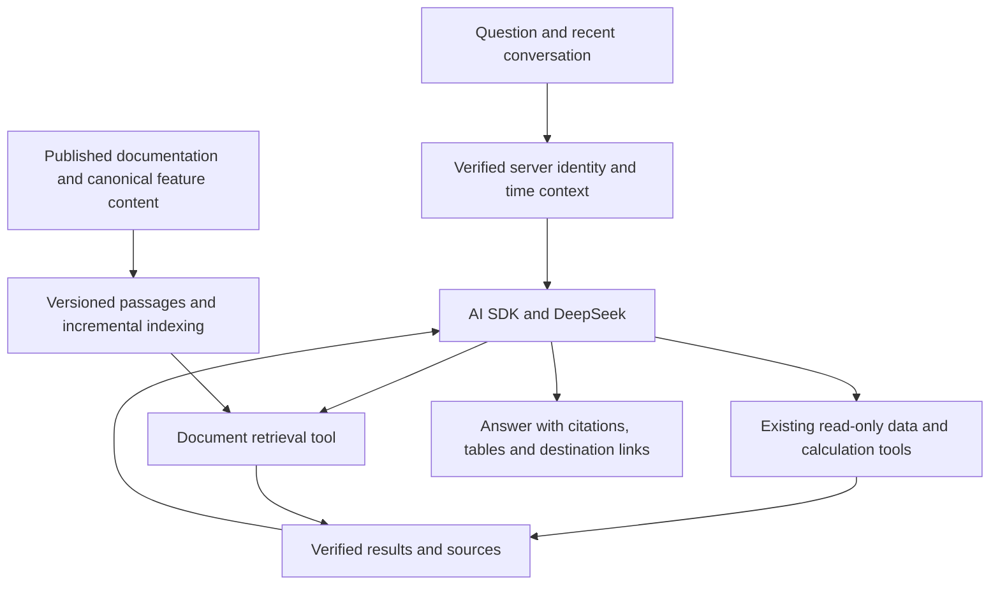

# CubeRoot site assistant

## Release integration (2026-10-10)

The owner authorized completing isolated acceptance and release after clarifying
that the no-swap rule applies to the local computer only. Integration uses the
current main branch in the attached `assistant-rag-release` checkout; unrelated
training-workspace, team and enterprise-verification work is excluded. The public
timer help is rendered in the existing timer settings and describes the current
timer and algorithm-library routes, rather than unpublished training menus.

The deployed PostgreSQL 13 development package exposes `pg_server_config`, not
`pg_config`; provisioning now detects that real path. Extension files were built
and installed without restarting PostgreSQL or enabling them in the business
database. Full-index acceptance uses `cuberoot_assistant_acceptance_20261010` via
the optional `SITE_ASSISTANT_KNOWLEDGE_DB_NAME` override. Production defaults to
the ordinary application database. Background batches have a 30-second deadline
and at most two explicit transient-failure retries (including per-attempt
timeouts); interactive query embeddings retain eight seconds
and no retries. Native answer streaming now parses the final `answer` field;
old custom JSON tool-plan framing is no longer part of the transport.

The isolated full-corpus run completed with **3,316 passages**, approximately
34.4 MiB database size and 152.7 MiB peak process RSS in the final resumed run.
This fixture uses the published corpus plus the release's canonical help, not
the future version 2 build artifact. Completed vectors survived timeouts and
were reused; the unchanged rerun required zero document embeddings. Real
Chinese/English hybrid retrieval took 267–349 ms in three probes. Failure before
publication preserved the old snapshot; an edit and deletion published
atomically, stale-corpus retrieval returned no passages, and restoring the
fixture succeeded. Production indexing remains a separate release acceptance.

The 20-case real-model suite validates the actual account binding against the
database, then exercises the authenticated Hono handler with DeepSeek Flash,
public data and Bailian embeddings. Independent SQL confirmed 2026 attendance
26, 2025 attendance 30, 2026 3x3 competitions 24 and 3x3 DNF attempts 2/220.
Year-filtered host countries were China 27 and Malaysia/Singapore/Vietnam 1 each
in 2025. Regression fixes preserve these scopes, requested comparisons and
denominators, future-data limitations, original reconstruction labels, and
readable passage citations. Correct answers are assessed from sources and
returned cells, not merely HTTP success. A correct year difference can still be
computed in model prose; this is not proof that every derived measure used SQL.

The suite also exposed an erroneous public glossary definition saying B was the
inverse in A B A'. The existing authenticated wiki editor API corrected term
115 in both languages; the normal `gen-glossary` exporter synchronized its sole
changed entry. The example `[R U: F] = R U F U' R'` was checked with cubing.js
`Alg.expand()` and its [official notation documentation](https://js.cubing.net/cubing/alg/).
Source quality remains part of maintaining RAG; retrieval alone cannot correct
erroneous reference content.

PR #125 merged as `2f122eb672`. Its required checks and Vercel/Next deployments
passed. The first Core release run `38074014587` rolled back during the existing
CubeOpt smoke: at 18:05:02 UTC the standalone test spawned PID 2339231; a real
request at 18:05:05 spawned API child 2339282. Both loaded the multi-GB table,
leaving 248 MiB available against the loader's 256 MiB floor. The AI migration
succeeded and the old API health check remained healthy after rollback.
Deployment now temporarily disables CubeOpt request admission during its
standalone smoke, then restores the original enabled/warm policy on success or
rollback, including lazy-load configurations. Disk-only releases preserve their
existing behavior. The 22 deployment-contract checks passed; production recovery
is verified separately. No memory threshold or system swap policy was relaxed.

## Earlier local implementation and acceptance (2026-10-10)

At this earlier checkpoint, the changes were **not committed, pushed or deployed**. The only production
configuration mutation in this task was the explicitly confirmed Bailian model
allowlist change: retain Qwen3.8-Flash and add text-embedding-v4. A real request
now returns one 512-dimensional vector; the previous 403 was reproduced before
that change. No keys or raw reasoning are included in this document.

- Native tool calling uses Vercel AI SDK with DeepSeek and OpenAI-compatible
  provider adapters. Tool schemas come from the existing strict executor schema;
  native call IDs, tool results and private reasoning round-trip within one
  request. The existing four-round/ten-call limits, authorization, cancellation,
  evidence review and restricted SQL projections remain in place. Thinking is
  automatic: low normally, high for analysis/repair, off for simple navigation.
  This is an application policy, not a proven general difficulty classifier.
- Public pages retain paragraph boundaries and are split with LangChain's
  recursive splitter (1,400 characters, 180 overlap). Metadata/loading shells
  are not content evidence. The training workspace and the index share one
  bilingual product explanation. Other client-only tools still need their own
  canonical public help to achieve comparable coverage.
- Retrieval uses ICU Chinese/English word segmentation, PostgreSQL full-text
  search and pgvector cosine distance, fused by reciprocal rank (k=60). Up to six
  passages are returned with stable IDs and canonical source links. Exact vector
  search is deliberate for a corpus capped at 30,000 passages; ANN should follow
  measured latency/recall needs. MiniSearch provides lexical fallback if vector
  service, database or snapshot freshness is unavailable. No cross-encoder
  reranker, private documents, arbitrary URLs or agent-authored SQL were added.
- The offline worker embeds batches of at most ten, reuses content fingerprints,
  stages complete corpus generations and publishes one atomic snapshot pointer.
  Failed batches leave the old snapshot intact; retries reuse completed vectors.
  Deleted/edited content cannot match a newer source corpus hash. The worker
  accepts only the fixed public artifact, caps it at 8 MB and defaults to 2,000
  new embeddings per run; source build version 2 is required. An unchanged corpus
  costs no new document embeddings. Model/endpoint/dimension changes invalidate
  reuse. Provider keys stay on the API host.
- Deployment code provisions pinned pgvector v0.8.7 and the restricted reader
  before migrations 0267/0270. The refresh timer follows the API's active release
  and checks for new website content every 15 minutes. It has a 192 MB Node heap,
  384 MB cgroup memory limit and a 15-minute application deadline. Server swap
  follows the existing host policy; cgroup v1 and v2 are both supported. The
  maintainer clarified that the no-swap requirement applies only to their local
  computer, not remote servers or CI. Full indexing remains blocked on the Mac.

### Validation and release boundary

Local PostgreSQL 16 + pgvector 0.8.7 fixtures verified Chinese/semantic retrieval,
source/language filters, failed-publication preservation, vector reuse, edits and
deletions. The separate public-analysis fixtures verified read-only permissions,
query cancellation/timeouts, monthly deduplication, joins, attempts and windows.
Native SDK tests verified reasoning stays out of UI callbacks and is retained in
provider tool continuations. Assistant, content-index and deployment-contract
checks passed; API typecheck and bundle passed. Client typecheck initially hit a
tsgo native crash, then passed with GOMAXPROCS=2. No Next build was run while the
development server was active.

Real-model diagnostics used a **small local bilingual help corpus**, real Bailian
embeddings and local pgvector, with real public APIs for WCA data. The final
training explanation read a passage and cited it (7.8 seconds); the authenticated
subject was supplied from the already-known test identity, not revalidated by
this in-process harness. The 2026 participation answer returned 26 unique
competitions from imported results (11.3 seconds, import timestamp supplied).
These checks are not a site-wide quality benchmark or a deployed browser test.
The local Chinese training page visibly renders the shared help paragraphs.

After the no-swap scope correction, the actual Alibaba Cloud Linux 3/systemd 239
host accepted the updated unit files. A temporary, isolated service with the
same 192 MB heap / 384 MB memory budget and hardening read the currently published
3,768,474-byte artifact: 1,460 pages, 1,334 with text. Together with the two new
canonical training help documents, it produced 3,318 passages. Peak process RSS
was 130.8 MiB after splitting and 201.7 MiB after building/searching the bilingual
lexical index. The first lexical lookup took 4.4 seconds including index creation;
warm lookups took 122–135 ms. Chinese and English training questions both ranked
the shared help document first; the regulation query returned regulation pages.
Two real embeddings requested from that server returned 512 dimensions each.
This capacity check used the existing published corpus plus the new help, not a
new version 2 site build, and did not write a production database or install a
persistent service. Database-inclusive indexing memory remains unmeasured.
A separate transient-service probe read an effective cgroup v1 memory limit of
402,653,184 bytes (384 MiB), with the existing host swap policy retained.
The refreshed worker bundle and API typecheck passed, as did all 21 existing
workflow path-contract checks. The Mac worker stopped at its server preflight
before fetching or indexing documents.

**Full-corpus indexing has not run.** Read-only production inspection found
PostgreSQL 13.23 without pgvector and a cgroup v1/systemd 239 host. The mistaken
server no-swap gate has been removed following the owner's scope clarification;
this host does not need a cgroup upgrade for indexing. This task did not change
the host boot mode, kernel, swap settings or production database. Production
semantic retrieval still requires a release: the workflow provisions pgvector,
applies the migrations and installs the bounded refresh timer; the version 2
website artifact must also be deployed, followed by indexing and production
acceptance. Until that snapshot is ready, retrieval falls back to lexical search.

Configuration: SITE_ASSISTANT_KNOWLEDGE_ENABLED=0 explicitly disables vector
retrieval/indexing. Embedding key/base default to the existing Bailian settings;
SITE_ASSISTANT_EMBEDDING_MODEL defaults to text-embedding-v4. Optional dedicated
credentials and job limits are documented in apps/api/.env.example. No separate
Dify service or knowledge-admin product is required for this developer-maintained
content workflow.

## Mainstream architecture decision (research, 2026-10-10)

The owner confirmed that the development team will maintain knowledge together
with website features. Recommended direction: **Vercel AI SDK + native tool
calling + hybrid document retrieval**, retaining Hono, PostgreSQL, DeepSeek and
the existing authorized data tools. The research below records the pre-implementation observations.
The local implementation and its acceptance boundary are recorded above.

### Evidence from maintained products and repositories

These are verified public capabilities and engineering guidance, not claims
about undisclosed company internals or a market-share ranking. Sources were
checked on 2026-10-10; GitHub maintenance and package versions can change.

| Reference | Verified approach | Decision for CubeRoot |
| --- | --- | --- |
| [OpenAI File Search](https://developers.openai.com/api/docs/guides/tools-file-search) | Hosted retrieval combines semantic and keyword search and is exposed as a model tool. | Follow the retrieval-as-a-tool pattern. Moving our model and documents to this hosted product is not required. |
| [Google RAG Engine](https://docs.cloud.google.com/gemini-enterprise-agent-platform/build/rag-engine/rag-overview) | Document ingestion, transformation/chunking, embedding, indexing, retrieval and generation are separate stages. | Build the complete document lifecycle, including updates and deletion, instead of only improving the answer prompt. |
| [Microsoft Azure AI Search](https://learn.microsoft.com/en-us/azure/search/hybrid-search-overview) | Full-text and vector retrieval run together, with RRF result fusion and optional semantic reranking. Exact identifiers and specialist terms benefit from keyword retrieval. | Use hybrid retrieval for WCA IDs, algorithm names, Chinese terminology and paraphrased questions; measure reranking before enabling it globally. |
| [Anthropic Contextual Retrieval](https://www.anthropic.com/engineering/contextual-retrieval) | Evaluates contextualized chunks, lexical/embedding retrieval and reranking together. | Preserve each passage's document title, heading and source context; verify improvements on our own questions. Their experimental gains are not CubeRoot results. |
| [Vercel AI SDK](https://github.com/vercel/ai), [tool loop](https://ai-sdk.dev/docs/agents/loop-control), [DeepSeek provider](https://ai-sdk.dev/providers/ai-sdk-providers/deepseek) | Maintained TypeScript SDK provides provider adapters, typed tools, streaming and bounded multi-step execution. DeepSeek exposes thinking and reasoning effort. | Preferred application SDK. It fits the existing Node/Hono stack and can use the provider directly without adopting a gateway or moving hosting. |
| [Dify](https://github.com/langgenius/dify), [retrieval settings](https://docs.dify.ai/en/cloud/use-dify/knowledge/create-knowledge/setting-indexing-methods) | A separate application platform with visual workflows, knowledge management, chunking and vector/full-text/hybrid retrieval. | Useful if non-developers must manage knowledge and workflows. The confirmed maintenance model favors integration with the existing application. Its license includes terms beyond unmodified Apache 2.0. |
| [LangGraph JS](https://github.com/langchain-ai/langgraphjs), [overview](https://docs.langchain.com/oss/javascript/langgraph/overview) | Durable execution, state, persistence and human interaction for long-running workflows. | Reconsider when resumable jobs or approval workflows are required. A short request with bounded read tools does not currently need this additional runtime. |
| [RAGFlow](https://github.com/infiniflow/ragflow) | A document-processing and RAG platform with rich parsing/OCR and additional deployment services. Its README recommends starting with 4 CPU cores, 16 GB RAM and 50 GB disk. | Stronger candidate for large PDF/scanned-document collections. Our first gap is usable website documentation; deploying this platform is not justified by that gap. No local service or large computation was started. |
| [Haystack](https://github.com/deepset-ai/haystack), [pipelines](https://docs.haystack.deepset.ai/docs/creating-pipelines) | Python components and pipelines for retrieval and agents. | A valid ecosystem, but adding a Python service is unnecessary for this TypeScript application. |
| [LlamaIndexTS](https://github.com/run-llama/LlamaIndexTS) | The TypeScript repository is archived and read-only, marked archived April 30, 2026. | Exclude this TS package from a new integration. This finding does not mean the separate Python project is archived. |

The npm registry returned `ai@7.0.137` and `@ai-sdk/deepseek@3.0.63`, both
requiring Node >=22, matching the API's Node 22 bundle target. The Vercel AI SDK
license text is Apache 2.0. Repository stars were inspected only as context;
runtime fit, provider behavior, maintenance and operating cost determine this
recommendation. No dependencies were installed during this research.

### What actually needs to change

Current-source observations are distinct from hypotheses about answer quality:

- `build-assistant-index.ts` primarily extracts prerendered public HTML; sitemap
  discovery can contribute a destination with an empty body. Client-only
  features may contribute metadata or loading placeholders instead of usage
  instructions. The earlier real-model timer comparison failed to retrieve
  the needed explanation with thinking both off and on.
- `site_assistant.ts` currently searches using substring matches and short
  Chinese tokens, takes four page hits and the first 10,000 characters per page.
  It does not perform semantic passage retrieval or reranking. A useful passage
  near the end of a long page can be missed.
- Tool requests are currently JSON embedded in ordinary model text, parsed by
  application code. Replacing this transport with native tool calls removes
  custom protocol handling; it is not evidence that all existing failures were
  caused by the protocol. Existing authorization and result validation remain
  application responsibilities.
- Thinking alone does not supply missing documentation or establish the validity
  of a statistical interpretation. The small diagnostic below is not a general
  quality benchmark. The automatic effort rule is an application heuristic,
  not a provider feature that has been proven to classify question difficulty.

For "how many competitions this year", the model selects a data tool and the
database computes from results. For "how does training mode work", it retrieves
published instructions. If a mixed question needs both, the same bounded tool
loop can do both. RAG means retrieving relevant material before generating an
answer; it does not require prewriting every answer or embedding every result
row. Missing raw data must remain distinguishable from a computed zero.

### Implementation sequence and acceptance

1. **Standardize model integration.** Use AI SDK and its DeepSeek adapter for
   native tools and streaming. Derive tool input schemas from the existing Zod
   contracts; preserve server identity, read-only limits, sources, cancellation,
   quotas and the overall deadline. Review the separately published generic
   analysis implementation when integrating: it is absent from this current
   checkout, so this checkout alone cannot establish combined acceptance.
2. **Fix knowledge coverage at its source.** Index public documentation and
   canonical feature descriptions with stable document/passage IDs, headings,
   language, source URL, content hash and actual revision metadata. Reuse the
   content rendered by the website; do not maintain an independent AI FAQ for
   every feature. Reject empty/loading-only bodies as content evidence. Keep
   navigation labels searchable separately. Update only changed content and
   remove deleted/unpublished passages. Private repository/administration data
   must not enter the public document pipeline.
3. **Add hybrid passage retrieval.** Prefer
   [pgvector](https://github.com/pgvector/pgvector) in the existing PostgreSQL
   deployment, plus a mature lexical search path. Verify extension availability
   before making a migration depend on it. Chinese tokenization must be tested;
   plain English PostgreSQL full-text search is insufficient.
   [PGroonga](https://pgroonga.github.io/overview/) is one verified multilingual
   extension candidate, not an already selected or installed dependency.
   Compare lexical, vector and hybrid recall on the same corpus. Use standard
   result fusion; enable a reranker if measured gains justify its latency/cost.
   An embedding provider/model, dimensions and revision strategy still need
   verification; the chat-model credential alone does not establish embedding
   availability. Embedding and reranking must not require a local model runtime.
4. **Measure the whole answer path.** Reuse the existing assistant benchmark
   entry and saved questions. Check expected source passages, correct tool
   selection, exact computed answers and citations separately from fluent prose.
   Cover identity, relative dates, Chinese/English paraphrases, WCA IDs, feature
   instructions, multi-step calculations, follow-ups and unavailable data.
   Record latency, tool failures and token cost; include known failures and
   questions not used to tune prompts. Adopt framework/retrieval changes only
   after comparison, without claiming accuracy from three smoke questions.

DeepSeek's [thinking tool-call contract](https://api-docs.deepseek.com/guides/thinking_mode/)
requires reasoning content to be passed back when native `tools` are used.
The SDK's [message converter](https://github.com/vercel/ai/blob/main/packages/deepseek/src/chat/convert-to-deepseek-chat-messages.ts)
handles reasoning parts. During migration, retain the required provider state
inside the server-side loop while excluding it from public UI and ordinary logs;
do not carry over the current no-native-tools rule of discarding all reasoning.
Keep a single default automatic user experience. Tune effort and token budgets
against answer quality and latency; no user-facing thinking selector is required
to complete this integration.

## Adaptive DeepSeek thinking (local, 2026-10-10)

- The backend enables DeepSeek thinking with `reasoning_effort: low` for model
  planning. Existing deterministic answers still bypass the model. Once the
  retrieved evidence consists only of navigation results, the next response
  uses non-thinking mode; statistical/analysis tools, multiple factual reads,
  or rejected plans raise effort to `high`. This follows selected work, not a
  hard-coded Chinese/English question classifier. There is no new user toggle.
- Thinking requests allow 8,192 total output tokens, or 16,384 at high effort,
  including reasoning. Non-thinking requests retain the existing 1,200 limit.
  Non-streaming transport allows up to 384,000 bytes when thinking is enabled.
  `finish_reason: length` triggers the existing single bounded repair attempt;
  the shared request deadline, quota and tool-call limits remain unchanged.
  Reasoning text is never forwarded to UI events, evidence, logs or later
  prompts. The other provider's configuration is unchanged.
- API typecheck and 83 focused grounding/streaming/resilience checks passed,
  including actual request options, navigation downgrade, statistical effort,
  truncated-output repair and exclusion of reasoning text in both transports.
- Six sequential real-provider requests compared thinking off with auto on the
  same three questions and public sources. Reasoning token usage confirmed the
  feature is active. One sample per condition is diagnostic, not a quality or
  latency benchmark; provider caching was uncontrolled.

| Question | Off | Auto | Observation |
| --- | ---: | ---: | --- |
| Open frame counting | 2.48 s | 2.30 s | Both found the correct destination; auto used low effort, then disabled thinking. |
| Compare two competitors' 3x3 PBs and discuss stability | 2.85 s | 2.87 s | Both compared PBs correctly. Auto added a weak inference from single/average PB gaps; thinking did not guarantee sound interpretation. |
| Explain timer training mode versus ordinary timing | 4.59 s | 10.66 s | Neither retrieved the necessary feature description. Auto performed more reads but still encountered page metadata/loading content and nearby tools. |

The next priority is usable feature-level documentation in retrieval, followed
by stronger analysis interpretation checks. These observations do not establish
a general accuracy improvement. The diagnostic used this current checkout,
which does not contain the separately published generic analysis implementation;
combined production acceptance remains outstanding. No code was committed,
pushed or deployed for this local change. Temporary diagnostic execution did
not replace the running API.

Provider contract: [DeepSeek thinking mode](https://api-docs.deepseek.com/guides/thinking_mode/).

## WC 2027 announcement (local, 2026-10-02)

- Added bilingual `/wca/wc-2027` summarizing the WCA July 2025 host-city
  announcement, with official source and application links. It distinguishes
  details absent from that historical announcement from current publication
  status. It does not appear in homepage sections.
- The page, search aliases and AI evidence share `site-announcements` data.
  `WC 2027`, `WC2027` and `2027年世锦赛` find the page. Explicit WC 2027 questions
  read the announcement before a planner can treat a missing competition listing
  as missing information. No private data or arbitrary external fetch is added.
- Shared build, API/client typechecks, 46 assistant tests and 12 search/metadata
  checks passed. Local HTTP returned 200 with the source and summary. Three
  direct real-model requests covered general information, registration and an
  English location question; these do not prove browser or production release.

## Site-wide destinations (local, 2026-10-02)

- Navigation now covers all real static page files (284 in the local snapshot),
  concrete Platform registry entries, published public content/sitemap pages,
  and existing algorithm/solver catalogs. New static pages enter the index at
  the next Web build. Titles and descriptions reuse `PAGE_META`; pages with no
  entry retain a route label. Navigation does not change SEO or sitemap policy.
- Noindex and account/admin entry pages can be offered as destinations using
  static labels only. Private HTML/data remains excluded from content evidence;
  clicking retains the page's existing access checks. Parameterized entity
  routes are not invented or filled with placeholders. Public data tools resolve
  actual people, competitions, reconstructions, forum threads and statistics;
  their selected source links also appear as Open buttons.
- General navigation ranks title, path and description matches, retaining the
  original question's topic when the planner paraphrases it broadly. A request
  to open a page stops after matching its destination, without an unnecessary
  content fetch. Public `/dev/auth` documentation is no longer mistaken for a
  root authentication route by the content-index exclusion.
- Six local real-model requests verified timer, sign-in flow documentation,
  forum posting, account details, administration and English architecture links.
  See [results](benchmarks/site-assistant-general-navigation-2026-10-02.json).
  Targeted API tests: 57 passed; content/navigation index tests: 9 passed;
  shared build and API/client typechecks passed. This is a local implementation,
  not a production deployment or browser acceptance claim; normal localhost
  chat still uses the production API until the changes are released.

## Existing-page navigation (local, 2026-10-02)

- Homepage chat can return explicit Open links for existing tools, algorithm
  libraries and trainers. The navigation tool accepts a topic and a destination
  kind; learning formulas and practising formulas use separate catalog choices.
  Ambiguous requests ask for the puzzle or training goal. Model-provided URLs
  are never accepted as destinations.
- Algorithm routes reuse `ALG_CATALOG`. Solver routes reuse the same event map
  as `SolveTabs`, extracted into `client/lib/solver-routes.ts`; the build-time
  public index includes those menu destinations and other rendered public tool
  links. This also indexes closed project-picker entries that are absent in SSR.
- Links retain the current language through AppLink. Solver links load a new
  document so their COOP/COEP headers take effect. Existing chat access and quota
  rules still apply.
- Five real-model local checks verified OLL/PLL learning (including OL/PL input),
  PLL training, 2x2 solving, clarification for an unspecified trainer, and an
  English Pyraminx solver request. See the [results](benchmarks/site-assistant-navigation-2026-10-02.json).
  API targeted tests: 54 passed; content-index tests: 6 passed; shared build and
  API typecheck passed. Client typecheck passed earlier in the task; the final
  run is blocked by a concurrent unrelated unused `lang` in
  `app/[lang]/overview/CostsFunding.tsx`. No production deployment or browser
  acceptance is claimed. Normal localhost chat continues to use the production
  API until the backend and new content index are released.

## Scope and evidence (2026-09-28)

The owner requested full-site natural-language answers and a conversation interface,
initially using Qwen 3.8 Flash, then requesting the official DeepSeek API on 2026-09-28. On 2026-09-28 the owner raised the target to a **site-wide limit of 1000 questions per Beijing day** (previously 100).
The reference is [CubeStats WCA Explorer](https://cubestats.in/wca). This is a
functional comparison, not authorization to copy unlicensed implementation code.

No matching public source repository or open-source license was found in the
reference site's About page or GitHub repository search. This does not establish
that its implementation is closed source.

### DeepSeek switch (local, 2026-09-28 America/Los_Angeles)

- Same-question acceptance: one complete 100-question official DeepSeek run plus
  34 targeted retests after evidence-grounding fixes. Latest per-question P50
  1.414 s, P95 2.839 s, maximum 3.591 s; 73 data answers, 23 scope clarifications,
  and 4 existing data/grain gaps. Initial failures are preserved in the
  [DeepSeek report](site-assistant-benchmark-deepseek-2026-09-28.md).
  These are serial API-host measurements, not browser or production-load proof.
  The 134 questions used the separate test ledger; production quota did not change.
  Earlier assistant work was locally committed as `8dc393b983`; these new fixes
  and test reports remain uncommitted and undeployed.

- API `.env` now selects `SITE_ASSISTANT_PROVIDER=deepseek`, reads the existing
  `DEEPSEEK_API_KEY`, and uses `DEEPSEEK_MODEL=deepseek-flash`. The key is sent only
  to the fixed official `https://api.deepseek.com` endpoint. A missing DeepSeek
  key disables the assistant instead of silently using a different provider.
- The [official request contract](https://api-docs.deepseek.com/api/create-chat-completion/)
  requires `thinking: { type: "disabled" }` for non-thinking mode. The assistant
  sends this field, retains JSON output and the existing bounded public-data tools.
  Bailian's separate `enable_thinking: false` is not sent to DeepSeek.
- Existing `SITE_ASSISTANT_API_KEY` / `SITE_ASSISTANT_BASE_URL` remain intact for
  the independent cube-agent comparison. Explicit `SITE_ASSISTANT_PROVIDER=bailian`
  selects the previous assistant configuration.
- Official `/models` returned HTTP 200 with `deepseek-flash` and `deepseek-v4-pro`;
  `/user/balance` returned HTTP 200 and `is_available: true` (not a claim of free use).
- Three local real-model/public-data smoke questions returned grounded answers
  with source tables: current 3x3 records **4.368 s**, reconstruction 2763
  **4.358 s**, top five record-breakers **3.561 s**. Seven model calls in total,
  all HTTP 200, all without reasoning content. These direct function tests did
  not use the production question ledger and are not browser/auth/load acceptance.
  Evidence: [DeepSeek smoke results](benchmarks/site-assistant-deepseek-2026-09-28-smoke.json).
- Targeted assistant tests: 33 passed; API typecheck passed. This change is prepared for a local commit only. Production environment and
  running service remain unchanged.
  Normal localhost Web requests still proxy to the production API unless the
  existing per-domain local API preview is explicitly enabled. The previous
  100-question Qwen benchmark must not be presented as DeepSeek acceptance.

### Verified references

| Product | Evidence | Implication for CubeRoot |
| --- | --- | --- |
| [CubeStats](https://cubestats.in/about) | About lists Next.js 16, React 19, TypeScript, LLM, Recharts, IndexedDB and WCA OAuth. Homepage describes Gemini/DeepSeek agents with live SQL queries. Browser tests returned records, comparison tables and four PR charts in a continuing conversation. | Query actual datasets, retain context, render structured results. Internal agent code remains unverified. |
| [CubeGPT](https://speedcubing.app/cubegpt) | Public page lists career progression, ranking history, comparisons and competition analysis. | Reuse existing CubeRoot person and competition pages as drill-down destinations. |
| [Perplexity](https://www.perplexity.ai/help-center/en/articles/10352903-what-is-pro-search) | Official help describes multi-source answers and contextual follow-ups. | Attach evidence and preserve follow-up context. |
| [Google Notebook](https://support.google.com/gemininotebook/answer/16179559?hl=en) | Official help describes source-grounded chat and citations. | Distinguish unavailable evidence from an empty result. |
| [GitHub Copilot](https://docs.github.com/en/copilot/how-tos/copilot-on-github/chat-with-copilot/get-started-with-chat) | Official documentation describes grounding in actual repository context and follow-ups. | Connect domain tools instead of treating a directory as the content itself. |
| [Metabase Metabot](https://www.metabase.com/docs/latest/ai/metabot) | Official product documentation covers an analytics assistant and embedded AI chat. | Keep data selection and visualization based on verified query results. |

## Acceptance checklist

The checked items below describe the earlier 100-question production release.
The new 1000-question migration and latency changes remain local and undeployed until explicitly released. See [response-time goals](site-assistant-performance.md).

The later access requirement is also local only: AI requires an authenticated
CubeRoot account with a currently linked real WCA ID, checked on the server before
quota reservation. It uses the existing account page and authentication header,
not a model decision or a client-supplied ID. The question API has no browser
CAPTCHA; other page/data protections remain. The 1000/day budget, account/IP burst
limits and concurrency protection remain; regular search stays available to guests.

- [x] Durable 100-question quota: reserve before model calls, count failed/cancelled calls, reject when storage is unavailable, reset at Beijing midnight. Local PostgreSQL fixture: 130 concurrent reservations admit exactly 100, reconnect retains limit, midnight starts next day.
- [x] Bilingual quota-exhausted message; regular search remains available.
- [x] Exact original question: 三阶魔方世界纪录. Answer single and average with holders, competition, date and data freshness.
- [x] Conversation UI: follow-ups, examples, stop, retry, new conversation, sources, accessible desktop/mobile layout.
- [x] Person profiles and PRs; resolve names without guessing WCA IDs.
- [x] Current/historical rankings, geographic/event/type filters.
- [x] Competitor comparisons and PR progression charts.
- [x] Upcoming and historical competition discovery.
- [x] Official competition scrambles by event/round.
- [x] Published reconstructions and analysis from recorded move sequences.
- [x] Public page search/read, including guides, regulation and math prose, plus glossary, algorithm and public forum adapters.
- [x] Representative bilingual, follow-up, unavailable-data and adversarial-query acceptance suite.
- [x] Deployment and real browser acceptance of the expanded assistant.

## Boundaries

API keys stay on the server. Public answers never receive admin/private records.
Every public question consumes one daily reservation even if the model needs
multiple bounded read operations. Model output is text, never executable SQL,
HTML, code or an arbitrary URL to fetch. Dates and result formatting use the
existing WCA contracts. Stored public data can lag official publication; show its
actual update time rather than implying live results.

Deployment evidence is recorded separately from local checks. Quota release:
`d55520764a`; expanded assistant code and final frontend: `bf2c55ac9a`. See the deployment evidence below.

## Originality requirement

The owner explicitly requested original example questions, wording, interface and implementation. CubeStats is only a capability benchmark. Public examples use CubeRoot-specific learning questions, different people and regions; no third-party source code or assets were copied. Feature breadth and correctness must be measured, not advertised as an unqualified superiority claim.

CubeStats was added to the production web directory under Competition & Stats (nav site 389), with an original bilingual description and https://cubestats.in/ as its destination. Browser search verification succeeded.

## Local acceptance evidence

- Later local-only performance work: [100 original questions](site-assistant-questions.md), two complete 100-question real-Qwen runs, five final targeted retests and browser checks. Latest per-question P50 4.31 s, P95 7.86 s, maximum 10.88 s; 73 data answers, 23 grounded scope clarifications and 4 documented data/grain gaps. See the [full report and preserved failures](site-assistant-benchmark-2026-09-28.md). This work remains undeployed; it does not change the earlier production release evidence below.

- Original records query now reads the published records bundle, including ties and its update date. Real Qwen call returned both 3x3 records and a source table.
- Real model/data calls covered person profiles, rankings, comparisons (four PR charts), competition discovery, WC2023 official final scrambles, public reconstruction 761, glossary questions and a contextual PR follow-up.
- Fixed stale upcoming index filtering and model interpretation of long PR arrays; model now receives programmatically computed first/current/recent milestones while charts retain every strict PR point.
- Data-adapter fixtures cover record ties, invalid results, stale competitions, private reconstruction exclusion, typed tool bounds and raw PR values. Route fixtures cover persistent quota behavior, failures, malformed inputs and bounded tool loops.
- Desktop dialog/chart rendering inspected with a recorded real-model response. 390×844 layout inspected without horizontal overflow. This is separate from pending production browser acceptance.
- Source code/type checks and targeted frontend/backend tests pass. Production build, content index and live browser checks are recorded below.

## Production acceptance (2026-09-28)

- Full Test workflow `36431064630` passed; Next deployment `36431064628` and Vercel deployment for `bf2c55ac9a` succeeded. Final API deployment `36431064705` also succeeded.
- Published index: 1,450 bilingual public page entries, 3.40 MB. 1,324 contain server-rendered text and/or the page’s public description; 126 are on-demand group-theory chapters (63 per language). This is a page-entry count, not 1,450 distinct topics or a claim that every interactive dataset is embedded in HTML. Restricted routes were absent.
- Browser on `https://cuberoot.me/zh`: original Geng progress question returned the correct person, PR table and two curves. A follow-up about his latest average returned Geng, 3.67 seconds, Jiajiang Open, 2026-07-25. The public competition record confirms that competition started and ended on that date.
- Fixed the discovered third-person/viewer confusion: a viewer ID is now supplied to the model only for explicit first-person requests. Model-generated person IDs require prior name resolution; output artifacts are restricted to the final cited sources.
- PLL training and group-theory questions returned actual page evidence and source links. Fixed overly broad header removal, which had stripped the teaching steps from the PLL guide. On-demand chapters are discovered from the existing sitemap and public link labels.
- Live English 2x2 records query returned HTTP 200, English prose, a source and a record table. Original Chinese 3x3 records were verified against the published dataset.
- Desktop, 390×844 layout and all four system/explicit light/dark combinations inspected. Mobile document and dialog widths were both 390 px; the conversation now sits above the floating pet. Viewport/media overrides were restored.
- New conversation, stop, close/reopen retention and retry after a failed request were exercised. Closing retains the current in-memory conversation; reloading does not persist it.
- The earlier CI reconstruction-label failures passed on an unchanged focused rerun and in the later full CI. No ground-truth expectations were weakened.

## Remaining boundaries

- Browser speech recognition has not been replaced with cloud ASR. Actual DJI microphone recognition and mobile speech still require hardware acceptance; text-assistant success is not evidence that voice input is fixed.
- The assistant uses bounded public read adapters and published statistical tables. It does not expose unrestricted SQL, private courses, admin content or arbitrary external-site crawling. Full feature parity or overall superiority over another product has not been established.
- Model prose can still misinterpret evidence. Tables/charts retain raw-source values; a PR series alone does not establish consistency, and its dates use competition start dates unless the source provides finer timing.

## Streaming UI update (2026-09-29 UTC)

- Browser requests SSE on the existing authenticated POST. Authentication and daily quota still precede streaming; JSON callers remain compatible. `X-Accel-Buffering: no` and `Cache-Control: no-store` prevent buffering/caching by the reverse proxy.
- Real tool stages drive the thinking/querying/writing indicator. Provider answer content arrives incrementally before completion; tool-planning JSON is never rendered. Adapter-authored factual summaries remain canonical and arrive together when complete.
- Inline `[[source ID]]` markers resolve only to retrieved internal sources. Partial markers stay hidden; unknown IDs do not become links. Repeated factual summaries are deduplicated, with their citations beside the relevant prose.
- Stop/disconnect retains received text as incomplete; it cannot become grounding for the next question. Scrolling upward suspends automatic scrolling. Closing/new conversation/account changes abort the active request.
- Local evidence: provider stream fixture proves text is delivered before provider completion; route fixtures cover authorization, quota/concurrency and typed stream errors; DOM fixtures cover live stages, split citations, stop, late events and interrupted responses. Publication is recorded separately after deployment.

## Conversation interaction refinement (2026-09-29 UTC, local)

The requested primary reference is ChatGPT. This is an original CubeRoot implementation using the existing theme, icons, source contract and read-only assistant API. Official documentation establishes behavior, not pixel-level measurements of the current authenticated product UI.

| Reference | Verified interaction | Application here |
| --- | --- | --- |
| [ChatGPT release notes](https://help.openai.com/en/articles/6825453-chatgpt-release-notes) and [search](https://help.openai.com/en/articles/9237897-searching-the-web-with-chatgpt) | Message copy/edit, response retry, conversation drafts and inline citations | Copy questions/answers, edit latest question, regenerate, retain draft while closed, citations within Markdown prose |
| [Gemini](https://support.google.com/gemini/answer/14262426?co=GENIE.Platform%3DDesktop&hl=en) | Regenerate latest answer; version navigation | Regenerate latest turn only; response-version history is not implemented |
| [Perplexity](https://www.perplexity.ai/help-center/en/articles/10352903-what-is-pro-search) | Source links and contextual follow-ups | Keep verified inline links and conversation context |
| [Microsoft Copilot](https://support.microsoft.com/en-us/microsoft-365-copilot/control-review-sources-copilot-chat) | Inspect the sources used in a response | Only retrieved sources become clickable citations |
| [Notion AI](https://www.notion.com/help/research-mode) | Source visibility during research and follow-up questions | Existing real lookup-stage feedback and continued conversation |
| [Claude](https://support.claude.com/en/articles/17161993-why-claude-switched-models-in-your-conversation-with-sonnet-5-5) | Edit a message and retry; transparently report model fallback | Latest-question editing; no model switching is claimed or added |

- Wider workspace with a centered 720 px reading column, quiet header controls, desktop full-screen toggle, mobile full-height layout and aligned composer.
- Auto-growing composer capped at 180 px, keyboard newline hint, coarse-pointer Enter retained as newline, and a counter near the existing 500-character limit. Unsent draft survives closing/reopening; new conversation and account change clear it.
- Safe Markdown uses existing `react-markdown`; HTML/images and arbitrary link destinations are excluded. Search preview and dialog share the same renderer. Copy includes tool tables/chart data and resolves inline source markers to links.
- Latest-turn regeneration/edit excludes the replaced answer from request history. Stopped partial turns remain visible when asking a follow-up but are not sent as model context.
- Scroll-follow pauses during upward reading; a floating arrow returns to latest. Response copy/regenerate actions remain available on touch devices.
- Local DOM tests exercise regeneration/edit context, draft retention/reset, rich-text safety, source links, copying data, full-screen and scroll-to-latest, in addition to the earlier stream tests. Visual acceptance remains with the owner; this entry does not claim deployment.

## Historical World Championship dates (2026-10-02, local)

- Explicit date questions for WC / World Championship / 世锦赛 read the full historical and upcoming competition indices directly. They return recorded start/end dates, per-edition citations, a table and verified competition links without a model planning round.
- Competition lookup recognizes WC2025, WC 2025 and championship aliases. A specified edition searches historical data even when the model retains the upcoming default. Canonical WCA WC IDs avoid matching unrelated local championships; no year/date list is hard-coded.
- Missing requested editions are reported as absent from the site records, without inferring cancellation or current announcement status. WC 2027 remains on the existing dated announcement path.
- Live public-index checks returned WC2025 = 2025-07-03~06 and WC2023 = 2023-08-12~15, matching the official WCA competition pages. The all-editions query returned all 12 recorded editions, including WC1982 = 1982-06-05.
- Targeted assistant/tool regression fixtures cover Chinese/English questions, both WC spellings, historical discovery despite the upcoming default, the earliest edition, unrelated competition exclusion and missing editions. Publication is not claimed by this local verification.

## Relative-year championship announcement lookup (2026-10-02, local)

- The reported `明年世锦赛在哪里办` failed to select the existing announcement because it contained no explicit 2027 alias. Shared discovery now accepts an optional reference year and resolves this/next/last year and the year after next in Chinese and English for championship questions. Explicit years take precedence; reversed wording such as `世锦赛 2027` also matches.
- The API supplies its UTC year to shared announcement discovery. Shared rendering/search never reads the current clock during SSR, and `next year` is not a permanent 2027 keyword. Forced announcement reading also prevents an early unrelated streamed answer.
- A real configured-provider call for the exact reported question returned Uppsala, Sweden, the dated official announcement citation and `/wca/wc-2027` action. Targeted API fixtures (53) and announcement/search fixtures (12) passed; shared build and API typecheck passed.
- The local announcement page returned HTTP 200. The development frontend's `/v1/*` rewrite still calls the production API; local commits do not update that API. Deployment remains separate from this local validation.

## General relative calendar context (2026-10-02, local)

- Relative time is now resolved before model planning for every question, using a server-authoritative clock and a validated browser IANA time zone. Legacy callers default to UTC. Browser clock values cannot override the server date; the zone is passed through both JSON and SSE routes.
- Shared pure calendar logic resolves Chinese/English previous/current/next years (including two years before/after), nearby days, calendar weeks (Monday–Sunday), months, and one week ago/from now. The same rules drive announcement discovery and historical World Championship date queries, rather than a permanent `next year = 2027` alias. Multiple resolved periods retain their order.
- All model rounds receive the visitor-local date, concrete periods and a normalized question. The competitions tool accepts validated inclusive from/to dates and filters overlapping competitions before limiting. One unambiguous relative period supplies missing date filters; historical periods read the full past index even if the planner keeps the upcoming default.
- Explicit event-anchored `前一周` and weekday-qualified weeks are left unresolved for interpretation instead of silently becoming a current calendar week. Rolling durations and arbitrary event-relative expressions are not claimed as fully deterministic parsing. Date interpretation alone does not establish that an event exists or supply missing facts.
- Targeted checks: 36 shared-calendar/announcement search fixtures and 73 assistant/data adapter fixtures passed, including timezone New Year boundaries, leap day, cross-year weeks, DST calendar dates, multiple periods, route timezone validation and actual competition date filtering. Shared build, API typecheck and client typecheck passed. Deployment is separate and not claimed here.

## Development frontend / older API compatibility (2026-10-02, local)

- Live diagnosis: POST with the newly added timeZone returned 400 invalid_question, while the identical legacy body reached authentication (401 login_required without credentials). The production API health and database were healthy. The generic client fallback mislabeled the schema rejection as assistant unavailability.
- The client now retries exactly once without timeZone only for 400 invalid_question. Accepted requests, authentication/quota failures, model failures and other 400 bodies are never retried. Both attempts preserve question/history, auth headers, streaming Accept and cancellation. Schema rejection occurs before authentication/quota/model work.
- Targeted transport fixtures passed (8), and client typecheck passed. New API deployments continue receiving the visitor time zone; the fallback uses the older API's existing date behavior and does not claim that unpublished relative-time/announcement changes are available online.
